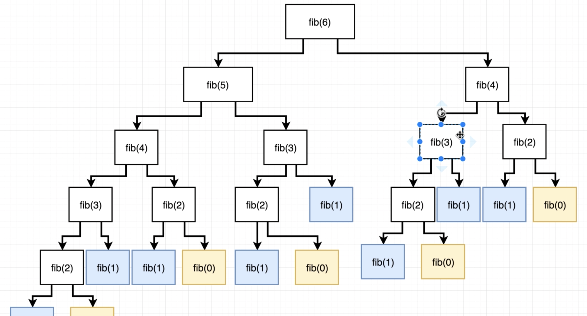

# Memoization

Memoization is an optimization technique used primarily to speed up computer programs by storing the results of expensive function calls and returning the cached result when the same inputs occur again.

Memoization **stores** the **arguments** of each function call along with the **result**. If the function is called again with the **same arguments**, the **result is returned** instead of calling the function again.

For example, the recursive fibonacci function is a common example of a function that has a time complexity of exponential.

```js
function fib(n) {
  if (n < 2) {
    return n;
  }
  return fib(n - 1) + fib(n - 2);
}
```

The fib function gets called many times, but you'll notice that many of these calls are the same.



We have 17 calls for the fib(5) function. For every additional element, we call fib() many more times. 

Interviewer may ask...**"Is there anything we can do with the recursive solution to improve the runtime?"**

Say "yes" and we can use **memoization** to speed up the function. The function is being called with **identical arguments.**

# Technique for Memoization

Will create a separate function called `memoize` that takes in a function and returns a new function. Takes in a slow function and returns a fast function.

The return function needs to accept the arguments that were indented to be accepted by the slow function. Have it accept `...args`. We do not know how many arguments the function will receive. 

```js
function memoize(fn) {
  // object to store all our calls
  const cache = {};

  return function (...args) {
    // if we have called the function with these arguments...
    if (cache[args]) {
      return cache[args];
    }

    //if we have NOT called the function before...
    const result = fn.apply(this, args);
    cache[args] = result;

    return result;
  };
}
```


## How would you apply memoize() in practice?

```js
function memoize(fn) {
  // object to store all our calls
  const cache = {};

  return function (...args) {
    // if we have called the function with these arguments...
    if (cache[args]) {
      return cache[args];
    }

    //if we have NOT called the function before...
    const result = fn.apply(this, args);
    cache[args] = result;

    return result;
  };
}

function fib(n) {
  if (n < 2) {
    return n;
  }
  return fib(n - 1) + fib(n - 2);
}
fib = memoize(fib);
console.log(fib(5));
```

```js