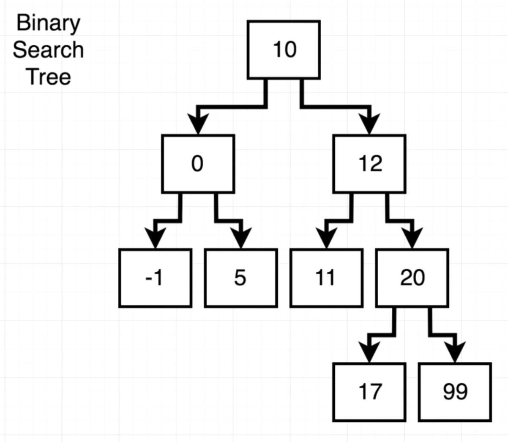
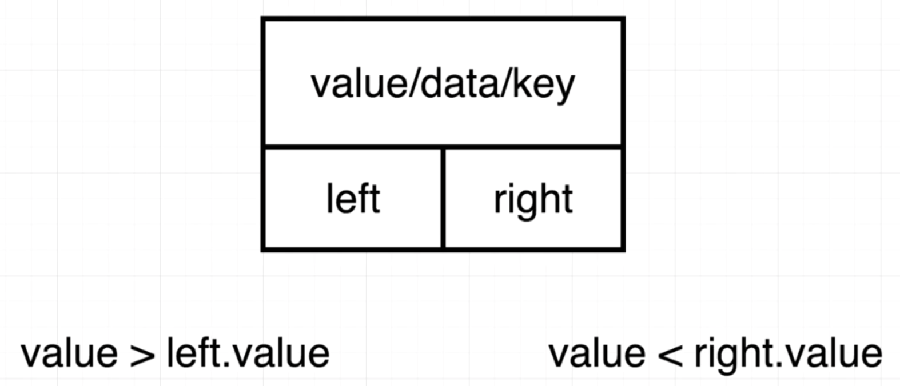

# Binary Search Tree

## Restrictions on a BST
- Every Node can have at most **two children**; left and right child.
- The **left child** must be **less** than the parent
- the **right child** must be **greater** than the parent.

>Basic structure of a binary search tree.


> Represents a single node. Data is often referred to as a key or value.


Very common interview question is top determine how to **add a new value to a binary search tree**.

# Implementation of BST

Directions:
1. Implement the Node class to create a binary search tree.  The constructor should initialize values 'data', 'left', and 'right'.
2. Implement the 'insert' method for the Node class.  Insert should accept an argument 'data', then create an insert a new node at the appropriate location in the tree.
3. Implement the 'contains' method for the Node class.  Contains should accept a 'data' argument and return the Node in the tree with the same value.

## Node class of BST

```js
class Node {
  constructor(data) {
    this.data = data
    this.left = null
    this.right = null
  }
}
```

## Insert() method for BST Node class

Often uses recursion. 

```js
  insert(data) {
    if (data < this.data && this.left) {
      this.left.insert(data);
    } else if (data < this.data) {
      this.left = new Node(data);
    } else if (data > this.data && this.right) {
      this.right.insert(data);
    } else if (data > this.data) {
      this.right = new Node(data);
    }
```

## Contains() method for BST Node class

```js
  contains(data) {
    if (data === this.data) {
      return this;
    } else if (data < this.data && this.left) {
      // data is smaller than node data, and we have a left node
      return this.left.contains(data);
    } else if (data > this.data && this.right) {
      // data larger than current node value as we have a right node
      return this.right.contains(data);
    } else {
      // if the data is not found in the tree
      return null;
    }
  }
```

## Validity of a BST - valid()

Directions:
Given a node, validate the binary search tree, ensuring that every node's left hand child is less than the parent node's value, and that every node's right hand child is greater than the parent.

When we move to the left, we update max to be the current node's value.

When we move to the right, we update min to be the current node's value.

```js
function validate(node, min = null, max = null) {
  // case in which we move to the left
  if (max !== null && node.data > max) {
    return false;
  }

  if (min !== null && node.data < min) {
    return false;
  }
  
  if (node.left && !validate(node.left, min, node.data)) {
    return false;
  }
  if (node.right && !validate(node.right, node.data, max)) {
    return false;
  }
  return true;
}
```
> If the recursive function returns false, then the tree is not valid.