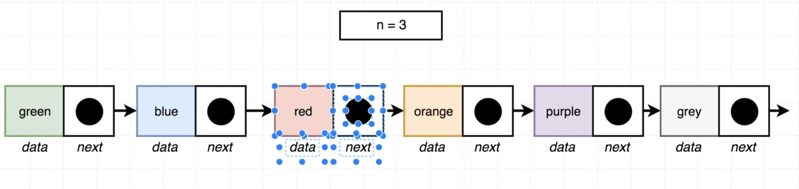

# From Last - Single Linked List

Directions: Given a linked list, return the element **n spaces** from the **last node** in the list.  Do not call the 'size' method of the linked list.  Assume that n will always be less than the length of the list.

Examples:
```js
   const list = new List();
   list.insertLast('a');
   list.insertLast('b');
   list.insertLast('c');
   list.insertLast('d');
   fromLast(list, 2).data // 'b'
```

## Strategy - From Last

So given an integer `n`, we want to return the node that is `n` spaces from the last node. If `n = 3`, we want to return the node which is 3rd from the last node.



Using `slow` and `fast` pointer strategy:
1. set both of the pointers to the head of the linked list.
2. advance the `fast` pointer by `n` nodes.
3. in a loop, advance **both** pointers by **one node** until `fast` is pointing to the last node.
   1. when `fast` is pointing to the last node, `slow` is pointing to the node we want.
   2. return `slow`.

## Solution - From Last

```js
function fromLast(list, n) {
  let slow = list.head;
  let fast = list.head;

  // advance fast by n number of times
  while (n > 0) {
    fast = fast.next;
    n--;
  }
  
  // advance both pointers by 1 as long as there is a next node
  while (fast.next) {
    fast = fast.next;
    slow = slow.next;
  }
  return slow;
}
```
