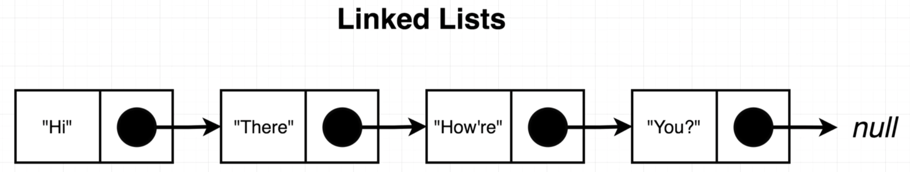

# Linked List

Seen **very** commonly in interviews.

Is an ordered collection of data. The collection contains a number of different **nodes**. 

Each node has a **data** and a **reference** property to the *next node* in the list.

- **Head node** is the first node in the list. 

- **Tail node** is the last node in the list. It does not have a reference to the next node.




## Node Class API

| Function         | Arguments    | Return | Description |
| ---------------- | ------------ | ------ | ----------- |
| Node.constructor | (Data, Node) | Node   |             |

## LinkedList Class API

| Function      | Arguments | Return     | Description                                                                                                                                                                                                                                                                  |
| ------------- | --------- | ---------- | ---------------------------------------------------------------------------------------------------------------------------------------------------------------------------------------------------------------------------------------------------------------------------- |
| constructor   | -         | LinkedList | Create a class to represent a linked list. When created, a linked list should have *no* head node associated with it. The LinkedList instance will have one property, 'head', which is a reference to the first node of the linked list. By default 'head' should be 'null'. |
| insertFirst   | data      | -          | Creates a new Node from argument 'data' and assigns the resulting node to the 'head' property. Make sure to handle the case in which the linked list already has a node assigned to the 'head' property.                                                                     |
| size          | -         | number     | returns the number of nodes in the list                                                                                                                                                                                                                                      |
| getFirst      | -         | Node       | returns the first node in the list                                                                                                                                                                                                                                           |
| getLast       | -         | Node       | returns the last node in the list                                                                                                                                                                                                                                            |
| clear         | -         | -          | removes all nodes from the list                                                                                                                                                                                                                                              |
| removeFirst   | -         | Node       | Removes only the first node of the linked list. The list's head should now be the second element.                                                                                                                                                                            |
| removeLast    | -         | Node       | removes the last node from the list                                                                                                                                                                                                                                          |
| insertLast    | data      | -          | Inserts a new node with provided data at the end of the chain                                                                                                                                                                                                                |
| getAt         | index     | Node       | returns the node at the specified index                                                                                                                                                                                                                                      |
| removeAt      | index     | Node       | removes the node at the specified index                                                                                                                                                                                                                                      |
| insertAt      | index     | data       | Creates and inserts a new node at provided index. If index is out of bounds, add the node to the end of the list.                                                                                                                                                            |
| forEach       | callback  | -          | calls the callback function for each node in the list                                                                                                                                                                                                                        |
| for...of loop | -         | -          | iterates over the list and calls the callback function for each node in the list. Linked list should be compatible as the subject of a 'for...of' loop.                                                                                                                      |

## Creating Node Class

```js
class Node {
  constructor(data, next = null) {
    this.data = data;
    this.next = next;
  }
}
```
> `next` has the default value of `null` because it is optional. It may not have a next node. 

## Linked List Class - Constructor

Will only have one property assigned to it, 'head', which is a reference to the first node in the list.

```js
class LinkedList {
  constructor() {
    this.head = null;
  }
}

const list = new LinkedList();
console.log(list) // null
list.head = '10';
console.log(list); // LinkedList { head: '10' }
```

## Linked List Class - insertFirst

