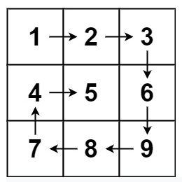

# Matrix

Directions:

Write a function that accepts an integer N
and returns a NxN spiral matrix.

Examples
```js
  matrix(2)
    [[1, 2],
    [4, 3]]
  matrix(3)
    [[1, 2, 3],
    [8, 9, 4],
    [7, 6, 5]]
 matrix(4)
    [[1,   2,  3, 4],
    [12, 13, 14, 5],
    [11, 16, 15, 6],
    [10,  9,  8, 7]]
```



`matrix = [[1,2,3],[4,5,6],[7,8,9]]`

Possible solution:
- Create empty array called `results`.
- Create a counter variable called `count` and set it to 1.
- As long as (start column <= end column) **AND** (start row <= end row) 
  - **loop** from start column to end column.
    - at `results[start row][i]` assign `count`variable.
    - increment `count` by 1.
  - increment `start row` by 1.
  - **loop** from start row to end row.
    - at `results[i][end column]` assign `count`variable.
    - increment `count` by 1.
  - decrement `end column` by 1.
  - ...repeat for other two sides. 

