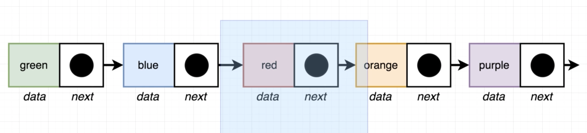
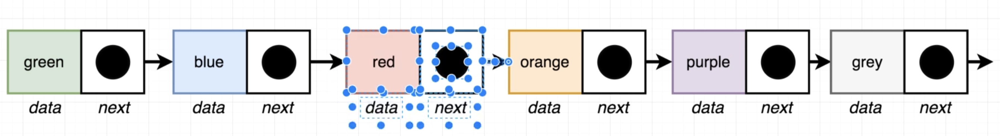
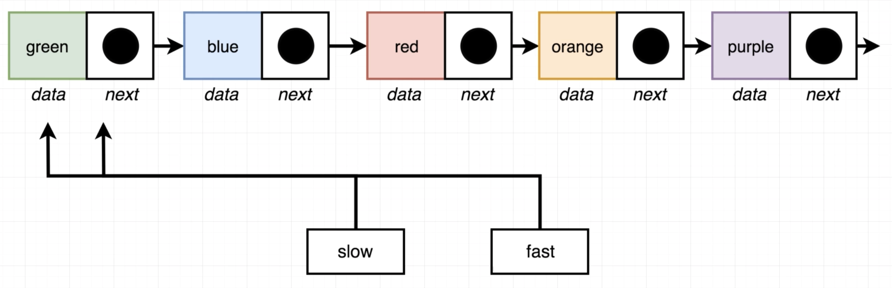
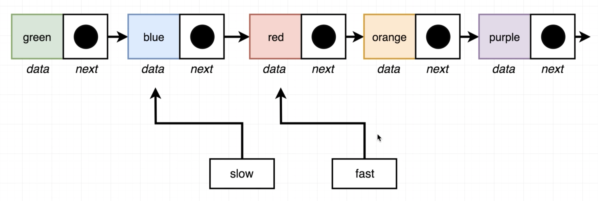
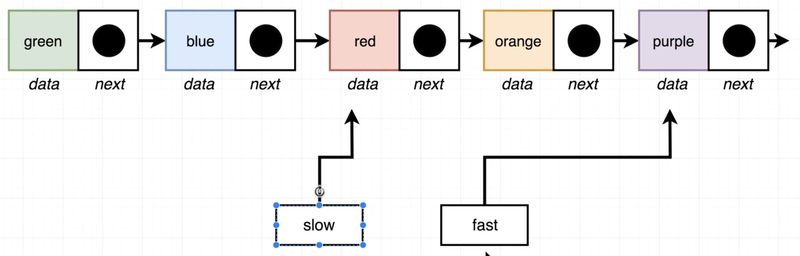
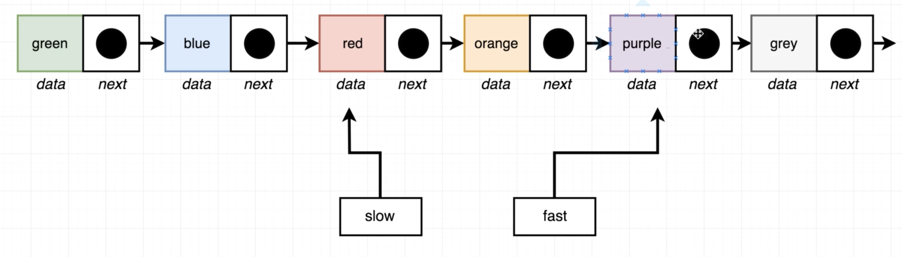

# Midpoint of Singly Linked List

A linked list will be provided.

Directions: 
- Return the 'middle' node of a linked list.
- If the list has an even number of elements, return the node at the end of the first half of the list.
- *Do not* use a counter variable
- *do not* retrieve the size of the list
- only iterate through the list one time.

Example:
```js
  const l = new LinkedList();
  l.insertLast('a')
  l.insertLast('b')
  l.insertLast('c')
  midpoint(l); // returns { data: 'b' }
```

> If you had an **odd** number of elements:


> If you had an **even** number of elements:


## Strategy

> Create two variables, `fast` and `slow`. Point both of these variables at the first node. 



Iterate through the linked list:
- Increment `slow` by one.
- Increment `fast` by two.
  
> `fast` will check to see if there are another two nodes to move to. If there are, we need to continue incrementing `fast` by two, and `slow` by one.


When `fast` reaches the end of the linked list, `fast` will be pointing to the last node. 

>We can then return `slow`.


---

What about if the list has an even number of elements?

> use the same strategy as above. When

