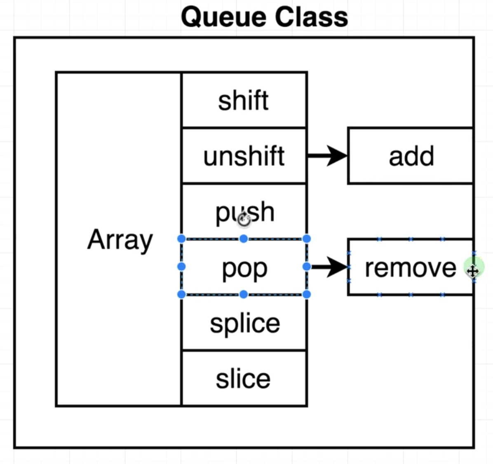

# Queue

First one in, first one out (FIFO).

Enqueue: add to the end of the queue.
Dequeue: remove from the front of the queue.

| Queue        | JavaScript Equivalent |
| ------------ | --------------------- |
| add to queue | `array.unshift()`     |
| remove from  | `array.pop()`         |

A common way to make a queue is to make a `queue class`, which has initialized an empty array. This array has tons of built in methods, but we will only expose the `unshift()` and `pop()` methods, limiting it to a **queue**. 



Description: Create a queue data structure.  The queue should be a class with methods 'add' and 'remove'. Adding to the queue should store an element until it is removed.

| We should be able to...                        | Run This                     |
| ---------------------------------------------- | ---------------------------- |
| Create a new, empty queue                      | `const queue = new Queue();` |
| Add an element to the end of the queue         | `queue.add(1);`              |
| Remove the element from the front of the queue | `queue.remove();`            |

Examples:
```js
    const q = new Queue();
    q.add(1);
    q.remove(); // returns 1;
```

# Making a Queue

```js
class Queue {
  constructor() {
    //create new, empty array
    this.data = [];
  }

  add(record) {
    this.data.unshift(record);
  }

  remove() {
    return this.data.pop();
  }
}
```