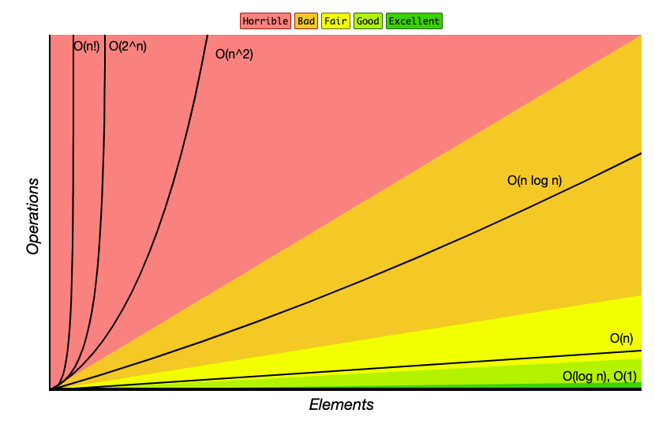

# Runtime Complexity

Describes the performance of an algorithm.

Will be asked this during an interview VERY often. 

"How much time does it take to run this algorithm if we doubled the input?"

## O(n) Linear runtime.

```js
function reverse(str) {
  let reversed = '';

  for (let character of str) {
    reversed = character + reversed;
  }
  return reversed;
}
```

Time complexity: O(n). Linear runtime. There is a direct relationship between the input size and the runtime. 

## O(n^2). Quadratic runtime

When you have a **double nested loop**, the runtime will be quadratic.
```js
function steps(n) {
  for (let row = 0; row < n; row++) {
    let stair = '';
    for (let col = 0; col < n; col++) {
      if (col <= row) {
        stair += '#';
      } else {
        stair += ' ';
      }
    }
    console.log(stair);
  }
}
```

Time Complexity: **O(n^2). Quadratic runtime**

# Determining Runtime Complexity

| Speed | Time             | Time Complexity | Reasoning                                                                                                                                                       |
| ----- | ---------------- | --------------- | --------------------------------------------------------------------------------------------------------------------------------------------------------------- |
| Best  | Constant Time    | O(1)            | No matter how many elements we are working with, the algorithm will **always** take the same amount of time.                                                    |
|       | Logarithmic Time | O(log n)        | You have this if doubling the number of elements you are iter does **not** double the amount of work. Always assume that `searching operations are log(n)`      |
|       | Linear Time      | O(n)            | Iterating through all elements in a collection of data. If you see a `for loop spanning from "0" to "array.length"`, you probably have `n` or **Linear runtime**. |
|       | Quasilinear Time | O(n log n)      | You have this if doubling the # of elements does NOT double the amount of work. Always assume that `sorting operations is n*log(n)`                             |
|       | Quadratic Time   | O(n^2)          | **Every element** in a collection has to be **compared to every other element.** 'The handshake problem'.                                                         |
| Worst | Exponential Time | O(2^n)          | If you add a **single** element to the collection, the processing power required doubles.                                                                       |


