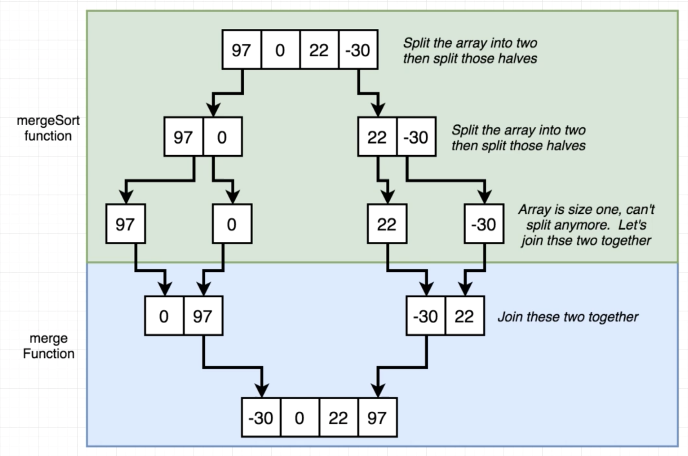

# Sorting Algorithms

Typically taking an unsorted array, and returning them from lowest to highest.

Very rare to be asked to implement a sorting algorithm.

# Complexity
| Name           | Worst Case Runtime | Difficulty to implement |
| -------------- | ------------------ | ----------------------- |
| Bubble Sort    | O(n^2)             | Easy                    |
| Selection Sort | O(n^2)             | Easy                    |
| Merge Sort     | O(n*log(n))        | Medium                  |
> **O(n^2)** is **bad** because every element we add **dramatically** increases the runtime. These are very bad for large data sets. But if you know you are using a small data set, then this is fine. 
>  **O(n*log(n))** is not too bad. Every time we add a new element it **increases the runtime by a small amount**. 

# Bubble Sort

Bubble sort, sometimes referred to as sinking sort, is a simple sorting algorithm that repeatedly steps through the list to be sorted, compares each pair of adjacent items and swaps them if they are in the wrong order (ascending or descending arrangement). The pass through the list is repeated until no swaps are needed, which indicates that the list is sorted.


Pseudocode:
```
from i = 0 to array length
  from j = 9 to (array length - i - 1)
    if array[j] > array[j+1]
      swap array[j] and array[j+1]
```
> We have two nested for loops, iterating over the same array. This is **O(n^2)**.

Solution:
```js
function bubbleSort(arr) {
  for (let i = 0; i < arr.length; i++) {
    for (let j = 0; j < arr.length - i; j++) {
      if (arr[j] > arr[j + 1]) {
        let temp = arr[j];
        arr[j] = arr[j + 1];
        arr[j + 1] = temp;
      }
    }
  }
  return arr;
}
```

# Selection Sort

Selection sort is a sorting algorithm, specifically an 
in-place comparison sort. 

It has O(n2) time complexity, 
making it inefficient on large lists, and generally 
performs worse than the similar insertion sort. 

Selection sort is noted for its simplicity, and it has 
performance advantages over more complicated algorithms 
in certain situations, particularly where auxiliary 
memory is limited.


Pseudocode:
```
from i = 0 to array length
  set minIndex to i, assume 'i' is the smallest value
  for j from i + 1 to end of array (array length)
    see if there's an element with a smaller value than minIndex
    if array[j] < array[minIndex]
      set minIndex to j
  swap array[i] and array[minIndex]
```

Solution:
```js
function selectionSort(arr) {
  for (let i = 0; i < arr.length; i++) {
    let minIndex = i;

    for (let j = i + 1; j < arr.length; j++) {
      // if found element with lesser value
      if (arr[j] < arr[minIndex]) {
        minIndex = j;
      }
    }
    if (minIndex !== i) {
      // swap
      let lesser = arr[minIndex]
      arr[minIndex] = arr[i]
      arr[i] = lesser;
    }
  }
  return arr;
}
```

## merge(left, right)

Left and right are two sorted arrays.

Purpose of merge() is to take two sorted arrays and merge them into one sorted array.

Pseudocode:
```
Create a 'result' array
While there are still elements in BOTH arrays
  If the first element on the left half is LESS than the first element on the right half
    `shift` the element from the left into the 'result' array
  Else
    `shift` the element from the right into the 'result' array
Take everything from the array that still have stuff in it an put it in results
```

Solution:
```js
function merge(left, right) {
  const result = [];

  while (left.length && right.length) {
    if (left[0] < right[0]) {
      result.push(left.shift());
    } else {
      result.push(right.shift());
    }
  }
  return [...result, ...left, ...right];
}
```

# mergeSort

First divide the list into the smallest unit (1 element), then compare each element with the adjacent list to sort and merge the two adjacent lists. Finally all the elements are sorted and merged.

- Purpose is to take some input array, and divide it into **one single element**. 
- We **recursively** call `mergeSort` on the two halves of the array.
- Once a single element is reached, we **merge** the two sorted arrays with `merge()`.
- Call `merge()` recursively until the array is sorted.





[Array.prototype.slice(startIndex, endIndex)](https://developer.mozilla.org/en-US/docs/Web/JavaScript/Reference/Global_Objects/Array/slice) returns everything between the startIndex and endIndex, but **NOT including the endIndex**. 

```js
function mergeSort(arr) {
  // base case
  if(arr.length === 1) {
    return arr;
  }

  // divide array into two equal halves
  const center = Math.floor(arr.length / 2);     // returns center index

  const left = arr.slice(0, center)
  const right = arr.slice(center)

  return merge(mergeSort(left), mergeSort(right))
}

function merge(left, right) {
  const result = [];

  while (left.length && right.length) {
    if (left[0] < right[0]) {
      result.push(left.shift());
    } else {
      result.push(right.shift());
    }
  }
  return [...result, ...left, ...right];
}

console.log(mergeSort([100, -40, 500, -124, 0, 21, 7])); // [-124, -40, 0, 7, 21, 100, 500]
```


