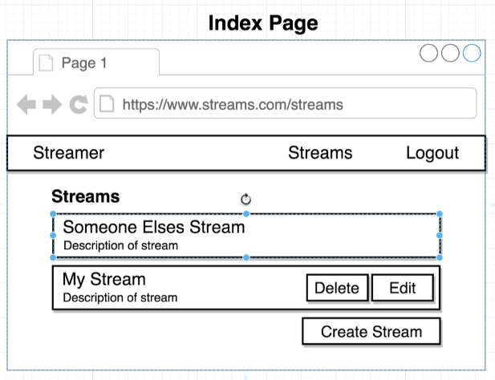

# General Authentication

Links:
[Oauth:](https://github.com/Cwarcup/notes/blob/main/root/react/react-notes/oauth.md#oauth-authentication)


# Displaying a specific option for a logged in user

Uses the [Twitch clone](https://github.com/Cwarcup/react-with-redux/tree/main/10-streams) as an example.

We want to display a delete and edit button for the streams that the user created.



We need to add the userId to the stream object when it is created. 

We can use the `getState` function to get the current state of the store, and access the auth object. In the response, we can add the userId to the stream object.

Over in the main actions index.js file, we can add the userId to the stream object.
```js
export const createStream = (formValues) => async (dispatch, getState) => {
  const { userId } = getState().auth; // getState() returns the entire state of the application, including the auth object.
  const response = await streams.post('/streams', { ...formValues, userId }); // second argument is the data we want to send to the server

  dispatch({ type: CREATE_STREAM, payload: response.data }); // payload contains the data we want inside of response
};
```

### Conditionally showing buttons if logged in

Right now, our userId is stored in our redux store. We need to get this userId from the auth object into our StreamList component. 

We can do this by using the `mapStateToProps` function:
```js
const mapStateToProps = (state) => {
  return { 
    streams: Object.values(state.streams), 
    currentUserId: state.auth.userId };
  // remember, our streams are an object. Need to get the values out of it.
  // use Object.values() to get the values out of the object.
  // now we have a prop called streams that is an array of all our streams.
};
```

Create a helper function `renderAdmin()` to check if the userId is equal to the current userId. If it is, we want to display the delete and edit buttons.
```js
  // method to render edit and delete buttons of logged in user created the stream
  renderAdmin(stream) {
    if (stream.userId === this.props.currentUserId) {
      return (
        <div className="right floated content">
          <button className="ui button primary">Edit</button>
          <button className="ui button negative">Delete</button>
        </div>
      );
    }
  }

  ////// add this helper function to the renderList() function ////

  renderList() {
    return this.props.streams.map((stream) => {
      return (
        <div className="item" key={stream.id}>
          {this.renderAdmin(stream)}     // <- added here
          <i className="large middle aligned icon camera"></i>
          <div className="content">
            {stream.title}
            <div className="description">{stream.description}</div>
          </div>
        </div>
      );
    });
  }
```