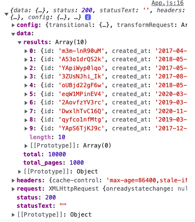

# Axios

[site:](https://axios-http.com/)

We have options to make requests to an API.

Axios: 
- is a 3rd party package.
- little larger
- much more simple

Fetch: 
- is a function built into modern browsers. 
- smaller builds
- will have to write more code

## Installing Axios

```
npm install --save axios
```

add at tope of file:
```js
import axios from 'axios';
```

# Authentication Header

Following docs from [Unsplash](https://unsplash.com/documentation#authorization)

Can pass the authorization as a **HEADER**
```js
class App extends React.Component {
  onSearchSubmit(term) {
    axios.get('https://api.unsplash.com/search/photos', {
      params: {
        query: term,
      },
      headers: {
        Authorization: 'Client-ID API KEY',
      },
    });
  }
```

Could also write it like so as a **QUERY PARAMETER**
```js
class App extends React.Component {
  onSearchSubmit(term) {
    axios.get('https://api.unsplash.com/search/photos', {
      params: {
        query: term,
        client_id: 'API KEY HERE',
      },
    });
  }

  render() {
    return (
      <div className="ui-container" style={{ marginTop: '10px' }}>
        <SearchBar onSubmit={this.onSearchSubmit} />
      </div>
    );
  }
}
```

# Return Object with `.then`

[Docs from Axios](https://axios-http.com/docs/res_schema)

After we submit a GET request, axios will return an object, often called `response`. 

```js
class App extends React.Component {
  onSearchSubmit(term) {
    axios
      .get('https://api.unsplash.com/search/photos', {
        params: { query: term },
        headers: {
          Authorization:
            'Client-ID API KEY',
        },
      })
      .then((res) => {
        console.log(res.data.results);
      });
  }
```
Get a response like so:
We are mostly interested in the **data property, and results**.


---

We can use the **`.then`** statement anytime we are working with a **promise**.

# Return Object with `async`
- need to add `async` to function name
- add `const response = await` in front of axios
- whatever gets returned from the URL, will get put into the `reponse`

```js
class App extends React.Component {
  async onSearchSubmit(term) {
    const response = await axios
      .get(//...
  //...
```

In our example:
```js
class App extends React.Component {
  async onSearchSubmit(term) {
    const response = await axios
      .get('https://api.unsplash.com/search/photos', {
        params: { query: term },
        headers: {
          Authorization: 'Client-ID API KEY',
        },
      });

    console.log(response.data.results);
  }
```

# Create custom clients - axios.create()

[axios docs on axios.create().](https://axios-http.com/docs/instance)

Can use `axios.create()` to make a new instance of axios with custom configurations.

```js
// new file
import axios from 'axios';

export default axios.create({
  baseURL: 'https://api.unsplash.com/',
  headers: {
    Authorization: 'Client-ID API KEY',
  },
});

```
