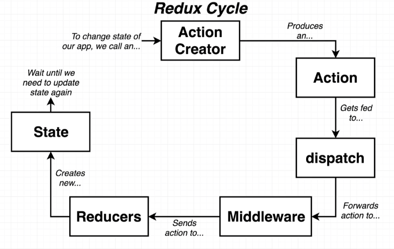
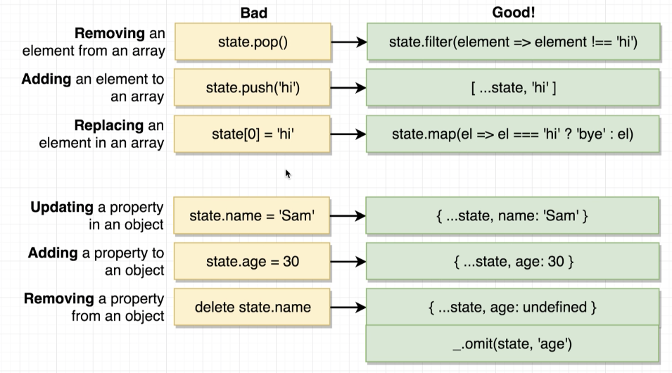

# How to fetch data in a redux app


We use a **class based component** so we easily have access to lifecycle methods such as `componentDidMount()`.

General Flow:
1. Component gets rendered onto the screen.
2. Components `componentDidMount` lifecycle method is called.
3. We call **action creator** from `componentDidMount` method.
4. Action creators runs code to **make an API request**, using axios.
5. API responds with data.
6. Action creator returns an `action` object with the **fetched data** on the **payload** property.
7. Some **reducer** sees the action, returns the data off the `payload`. 
8. Because we generate some new state object, redux/react-redux causes our React app to be re-rendered.

Steps 1 - 3: **Components** are generally responsible for **fetching data** the need by calling an **action creator**. Usually some a lifecycle method like `componentDidMount()`.

Steps 4 - 6: **Action Creators** are responsible for **making API requests**. This is where **Redux Thunk** comes in to play. 

Steps 7 - 8: We get fetched data into a components by generating new state in our redux store, then getting that into our component through`mapStateToProps`.

# Wiring up an Action Creator

Steps 1 - 3:

in src/action/index.js:
```js
// rxaction snippet

export const fetchPosts = (payload) => ({
  type: 'FETCH_POST',
});
```

In src/components/PostList.js:
- import connect method from react-redux
- import the action creator
```js
import React, { Component } from 'react';
import { connect } from 'react-redux';
import { fetchPosts } from '../actions';

class PostList extends Component {
  componentDidMount() {
    this.props.fetchPosts();
  }
  render() {
    return <div>PostList</div>;
  }
}

export default connect(null, { fetchPosts })(PostList);
```


# Middleware in Redux

**Synchronous action creators ***instantly* return an action withy data ready to go. 

**Asynchronous action creators** take *some amount of time* for it to get it's data ready. This requires some kind of **middleware** to handle the asynchronous request.

## What is a middleware in Redux?



An action gets send to our **middleware** before being sent off to the reducers. 

- Is a **function** that gets called with *every action we dispatch*. 
- It has the ability to **STOP, MODIFY** or **ADD** to our **actions**.
- There are tons of open source middleware libraries.
    - most popular middleware is for *dealing with async actions*.
    - we are going to use a middleware called **redux-thunk** to solve our async issues.

See redux-thunk notes here: Covers steps 4-6.

# setup Reducers

Recall, we have an Action creator (fetchPosts) that returns an action object. It has type `FETCH_POSTS` and payload with the data. The reducer is responsible for watching for actions with type `FETCH_POSTS` and returning the data off the payload.


In your reducer folder, have your main `index.js` and `reducer.js` files. In my case, I have a `postReducer.js` file.

Inside index.js, use the `combineReducers` method to combine all of our reducers.
```js
import { combineReducers } from 'redux';
import postReducer from './postReducer';

export default combineReducers({
  posts: postReducer,
});
```

## Rules of Reducers

- Must return any value besides `undefined`.
  - must have a return statement.
- Produces `state`, or data to be used inside of your app using only previous state and the action (reducers are pure functions).
- Must NOT return reach 'out of itself' to decide what value to return.
- Must not mutate its input `state` argument.
  - only need to worry about mutation when returning an array or object. 
  - these rules do not apply for numbers or strings.
  - this rule is misleading...it IS possible to mutate the input `state` argument. Redux will not throw an error message. However, people/docs say you should not. 

```js
export default () => {

  //bad! - causes mutation
  state[0] = 'sam'
  sate.pop()
  state.push()

  //bad!
  state.name = 'sam'
  state.age = 30

  // BAD! - returns something outside itself
  return document.querySelector('input');

  // BAD!
  return axios.get('/posts');
};
```
```js
export default (state, action) => {
  // good
  return state + action
};
```

# Safe State Updates in Reducers



Good video on this: [link](https://www.udemy.com/course/react-redux/learn/lecture/12586898#content)

# Switch Statements in Reducers

Rather than having an `if` statement like so:
```js
export default (state = [], action) => {
  if (action.type === 'FETCH_POSTS') {
    return action.payload;
  }
  return state;
};
```

We can use a switch statement instead:
```js
export default (state = initialState, action) => {
  switch (action.type) {
    case 'FETCH_POSTS':
      return action.payload;

    default:
      return state;
  }
};
```

# action creators - example API async await fetch

```js
import jsonPlaceholder from '../apis/jsonPlaceholder';

// fetch multiple posts from jsonPlaceholder
export const fetchPosts = () => async (dispatch) => {
  const response = await jsonPlaceholder.get('/posts');

  dispatch({ type: 'FETCH_POSTS', payload: response.data });
};

// fetch one individual user at a time from jsonPlaceholder
export const fetchUser = (id) => async (dispatch) => {
  const response = await jsonPlaceholder.get(`/users/${id}`);

  dispatch({ type: 'FETCH_USER', payload: response.data });
};
```

# Steps for setting up new action creators, reducer, and new component

1. Create a new action creator.
    - async await
    - dispatch function

```js
import jsonPlaceholder from '../apis/jsonPlaceholder';

// fetch multiple posts from jsonPlaceholder
export const fetchPosts = () => async (dispatch) => {
  const response = await jsonPlaceholder.get('/posts');

  dispatch({ type: 'FETCH_POSTS', payload: response.data });
};
```

2. Create new component

```js
// attempts to fetcher the user data from jsonPlaceholder with respective userId
// accepts prop `userId` from PostList component

import React, { Component } from 'react';
import { connect } from 'react-redux';
import { fetchUser } from '../actions';

class UserHeader extends Component {
  componentDidMount() {
    this.props.fetchUser(this.props.userId);
  }
  render() {
    // find the user we care about
    const user = this.props.users.find((user) => user.id === this.props.userId);

    if (!user) {
      return null;
    }

    return <div className="header">{user.name}</div>;
  }
}

const mapStateToProps = (state) => {
  return { users: state.users };
};

export default connect(mapStateToProps, { fetchUser })(UserHeader);
```

3. New reducer: catch the new action creator and make the data available to the component.

```js
export default (state = [], action) => {
  switch (action.type) {
    case 'FETCH_USER':
      return [...state, action.payload];
    default:
      return state;
  }
}
```

4. Add new reducer to the `combinedReducers` in the `index.js` file.

```js
import { combineReducers } from 'redux';
import postReducer from './postReducer';
import usersReducer from './usersReducer';

export default combineReducers({
  posts: postReducer,
  users: usersReducer,
});
```

# ownProps

- is a second copy of the props object that is passed to the component.
- idea is that we can extract anything that is going to computation on our state to the mapStateToProps function.

```js
import React, { Component } from 'react';
import { connect } from 'react-redux';
import { fetchUser } from '../actions';

class UserHeader extends Component {
  componentDidMount() {
    this.props.fetchUser(this.props.userId);
  }

  render() {

    const { user } = this.props;
    
    if (!user) {
      return null;
    }

    return <div className="header">{user.name}</div>;
  }
}

// find the user we care about here instead
const mapStateToProps = (state, ownProps) => {
  return { user: state.users.find((user) => user.id === ownProps.userId) };
};

export default connect(mapStateToProps, { fetchUser })(UserHeader);
```

# Action Creators referencing other action creators

In some cases, you may want to have one large action creator that utilizes other action creators. For example, if you have a fetchUser and fetchPosts action creator. You could combine both of these into one action creator, fetchPostsAndUsers().

fetchPostsAndUsers() will...
  - call `fetchPosts`
  - get a list of posts
  - find all unique `userId`s from the posts
  - iterate over unique `usrId`s and call `fetchUser` for each userId

Calling fetchPosts:
```js
export const fetchPostsAndUsers = () => async (dispatch) => {
  console.log('About to fetchPostsAndUsers');
  await dispatch(fetchPosts());
  console.log('fetchPostsAndUsers');
};

// fetch multiple posts from jsonPlaceholder
export const fetchPosts = () => async (dispatch) => {
  const response = await jsonPlaceholder.get('/posts');

  dispatch({ type: 'FETCH_POSTS', payload: response.data });
};

// fetch one individual user at a time from jsonPlaceholder

export const fetchUser = (id) => async (dispatch) => {
  const response = await jsonPlaceholder.get(`/users/${id}`);

  dispatch({ type: 'FETCH_USER', payload: response.data });
};
```

Getting our lists of posts:
Remember, a thunk function is a function that accepts two arguments: the Redux store `dispatch` method, and the Redux store `getState` method.

`getState()` returns the current state of the store.
```js
export const fetchPostsAndUsers = () => async (dispatch, getState) => {
  await dispatch(fetchPosts());
  console.log(getState().posts); // returns all the list posts
};
```

Finding the unique userIds: Can use lodash for this. Lodash has a built in map function that will iterate over an array and return a new array with only userIds, then we can use `uniq` to get the unique userIds.
```js
export const fetchPostsAndUsers = () => async (dispatch, getState) => {
  await dispatch(fetchPosts());
  const userIds = _.uniq(_.map(getState().posts, 'userId'));
  console.log(userIds);
};
```

Iterating over the unique userIds, calling `fetchUser` for each userId:
```js
export const fetchPostsAndUsers = () => async (dispatch, getState) => {
  await dispatch(fetchPosts()); // call `fetchPosts`, need await to wait for `fetchPosts` to finish
  const userIds = _.uniq(_.map(getState().posts, 'userId')); // get list of unique userIds from posts using lodash
  userIds.forEach((id) => dispatch(fetchUser(id))); // iterate over userIds and call `fetchUser` for each userId
};

// fetch multiple posts from jsonPlaceholder
export const fetchPosts = () => async (dispatch) => {
  const response = await jsonPlaceholder.get('/posts');

  dispatch({ type: 'FETCH_POSTS', payload: response.data });
};

// fetch one individual user at a time from jsonPlaceholder

export const fetchUser = (id) => async (dispatch) => {
  const response = await jsonPlaceholder.get(`/users/${id}`);

  dispatch({ type: 'FETCH_USER', payload: response.data });
};
```

> With this, we can still fetch a single suer with `fetchUser`, or all posts with `fetchPosts`. But we can now also do both at the same time, once, with `fetchPostsAndUsers`.`

