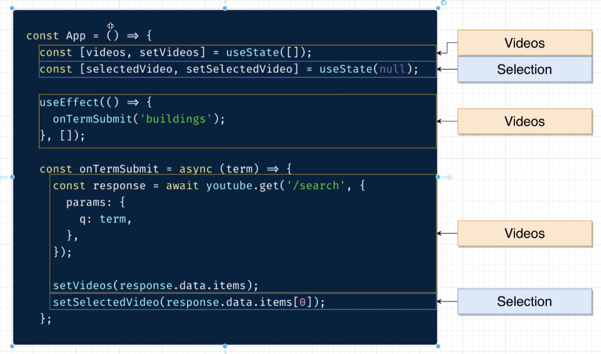
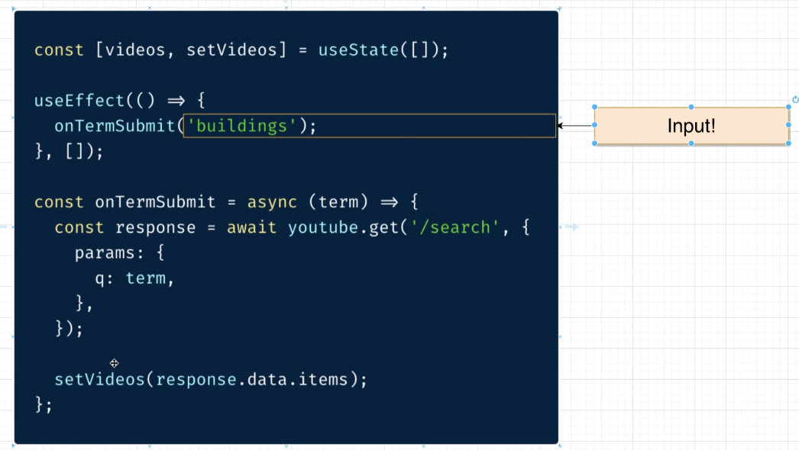
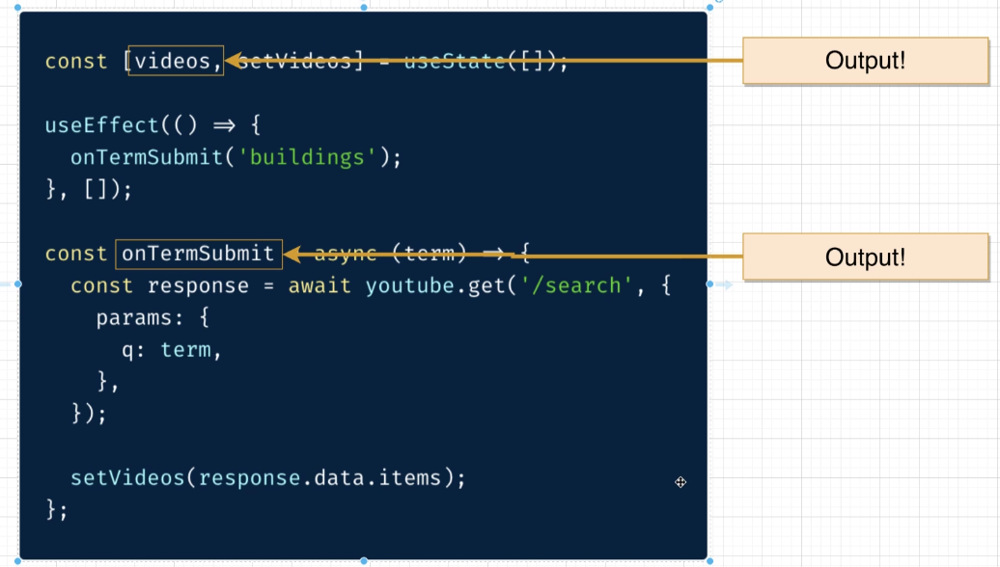

# Custom Hooks

Is a hook that can be used by other components that are similar. It extracts component logic into a reusable function. 

IT IS NOT LIKE BUILDING A DIFFERENT USESTATE OR USEEFFECT.

For example, if we were YouTube and we have an App component and an Analytics Component, we may want to use a **custom hook** to extract the **logic for fetching videos** in both. Instead of duplicating our code, we could create a custom hook. 

**Custom Hooks**
- Best way to create reusable code in a React project (besides components).
- Created by extracting hook-related code out of a function component.
- custom hooks **always** make use of at least **one primitive hook internally**.
  - useState, useEffect
- each custom hook should have **ONE purpose**.
- data-fetching is a great thing to try and make reusable.

For example, in the `Appjs` file of ["7-video-player-hooks"](https://github.com/Cwarcup/react-with-redux/blob/4f974064c269a2b2732e1be29e72b1c881aaa7ce/7-video-player-hooks/src/components/App.js#L8-L24) we want to make this code reusable. 

```js
  const [videos, setVideos] = useState([]);
  const [selectedVideo, setSelectedVideo] = useState(null);

  useEffect(() => {
    onTermSubmit('react js');
  }, []);

  const onTermSubmit = async (term) => {
    const response = await youtube.get('/search', {
      params: {
        q: term,
      },
    });

    setVideos(response.data.items);
    setSelectedVideo(response.data.items[0]);
  };
```

# General Process for Creating a Custom Hook

1. Identify each line of code related to some single purpose. 
2. Identify the **inputs** to that code. 
3. Identify the **outputs** from that code.
4. Extract all of that code into a **separate function**, receiving the inputs as arguments, and returning the outputs.


For the "Videos" related code:
1. We want to look at everything associated with our custom hook. Id the purpose of each line of code.
   - We are managing two pieces of state (videos, and selectedVideo)
   - the `useEffect` is used to fetch a list of videos. 
   - the `onTermSubmit` is all about fetching the videos and updating the videos state.



2. Inputs - What are the arguments required to make those inputs run?
   - Within `onTermSubmit()`, the argument (default search term) is the only thing required for that `onTermSubmit()` to run.
  


3. Outputs - What do we get back from this component?
   - are the only variables we make use of anywhere else in our component.



Sentence to remember:
"If you give me a <**List of inputs**>, I will give you a <**List of outputs**>."

For our case:
"If you give me a <**default search term**>, I will give you a <**List of videos**><**a way top search for videos**>."

Here is our code in a new hooks file:
```js
import { useState, useEffect } from 'react';
import youtube from '../apis/youtube';

// custom hook to handle videos and setVideos
// input is the default search term in useEffect
// output is a list of videos and a way to search for videos (onTermSubmit)

const useVideos = (defaultSearchTerm) => {
  const [videos, setVideos] = useState([]);

  useEffect(() => {
    search(defaultSearchTerm);
  }, []);

  const search = async (term) => {
    const response = await youtube.get('/search', {
      params: {
        q: term,
      },
    });

    setVideos(response.data.items);
  };

  // return an array with videos and onTermSubmit
  return [videos, search];
};

export default useVideos;
```

Code in App.js
```js
import React, { useState, useEffect } from 'react';
import SearchBar from './SearchBar';
import VideoList from './VideoList';
import VideoDetail from './VideoDetail';
import useVideos from '../hooks/useVideos';

const App = () => {
  // destructure the returning variables form the array returned by useVideos
  const [videos, search] = useVideos('react js');

  const [selectedVideo, setSelectedVideo] = useState(null);

  useEffect(() => {
    setSelectedVideo(videos[0]);
  }, [videos]);

  return (
    <div className="ui container">
      <SearchBar onFormSubmit={search} />
      <div className="ui grid">
        <div className="ui row">
          <div className="eleven wide column">
            <VideoDetail video={selectedVideo} />
          </div>
          <div className="five wide column">
            <VideoList onVideoSelect={setSelectedVideo} videos={videos} />
          </div>
        </div>
      </div>
    </div>
  );
};

export default App;
```

