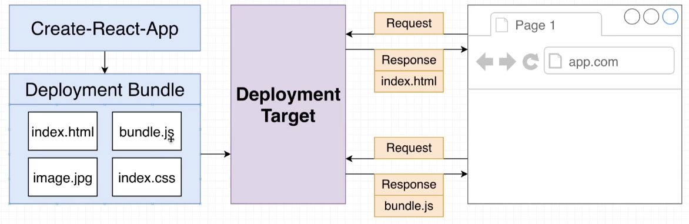

# Deployment with React

When we use 'Create-React-App' it automatically creates a **deployment bundle for us**. These are static, normal files that can exist in a folder directory. 

Deployment target is our hosting service.

# Deployment with Vercel

While within your project directory...
1. Sign up for [Vercel](https://vercel.com/)
2. Install the Vercel CLI 
   - `npm install -g vercel`
   - login with `vercel login`. Select github option.
3. Run 'vercel' in our project directory
   - can press enter for all the default settings

## Re-deploy with Vercel - updating project

`vercel --prod`

# Deployment with Netlify

1. Create a github repo for your project
2. commit changes to your project locally
   - `git add .`
   - `git commit -m "message"`
3. link your project to the new repo
4. push your code to github
5. sign up for account at [netlify.com](https://www.netlify.com/)
6. Link your github account, select the repo you want to deploy