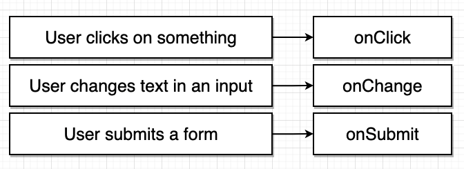
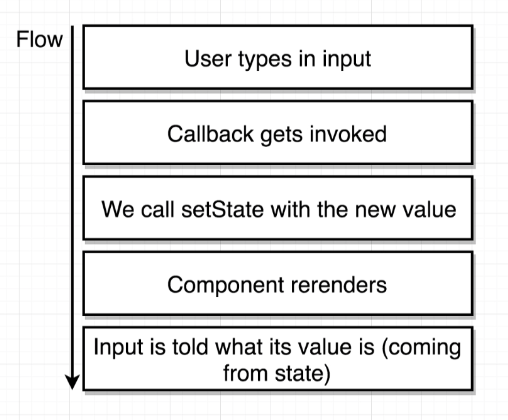

# Event Handlers

- [W3 docs for reference.](https://www.w3schools.com/react/react_events.asp)

**[onChange](https://reactjs.org/docs/dom-elements.html#onchange)**
- whenever a form field is changed, this event is fired.

Here we want to detect any changes when a user types in the input:
```js
class SearchBar extends React.Component {
  onInputChange(event) {
    console.log(event.target.value);
  }
  render() {
    return (
      <div className="ui segment">
        <form className="ui form">
          <div className="field">
            <label>Image Search</label>
            <input type="text" onChange={this.onInputChange}></input>
          </div>
        </form>
      </div>
    );
  }
}
```

`onChange={this.onInputChange}` does not have `()` on the end of the `onInputChange` because if we did, it would get run every time the `render()` method is called. 
Instead, we are creating a reference to the method on the input element, allowing us to call the method in the future. 

So now whenever a user types something into the input, our callback (onInputChange) will be run.

Over in the method `onInputChange(event)` we pass **one argument** to it. This is an object that contains a bunch of information about what occurred.
We usually only care about the property **`event.target.value`**.


- is we use the `onClick` method, anytime a user makes a click event, the callback function passed through here will be called. 

For example, if a user clicks the input or types in the input, console will return the respective text when clicked or typed. 
```js
class SearchBar extends React.Component {
  onInputChange(event) {
    console.log(event.target.value);
  }

  onInputClick() {
    console.log('Input was clicked');
  }
  render() {
    return (
      <div className="ui segment">
        <form className="ui form">
          <div className="field">
            <label>Image Search</label>
            <input
              type="text"
              onClick={this.onInputClick}
              onChange={this.onInputChange}
            ></input>
          </div>
        </form>
      </div>
    );
  }
}
```

# Alternative Syntax for Event Handlers

You can use an arrow function within the `onChange` event handler like so:
```js
class SearchBar extends React.Component {

  render() {
    return (
      <div className="ui segment">
        <form className="ui form">
          <div className="field">
            <label>Image Search</label>
            <input
              type="text"
              onChange={(event) => console.log(event.target.value)}
            ></input>
          </div>
        </form>
      </div>
    );
  }
}
```
> This eliminates the need for a separate function like `onInputChange()`.


This is best to use when we have a single line of code we want to execute when some event occurs.

'event' is often referred to as `e`.
```js
onChange={(e) => console.log(e.target.value)}
```

## Controlled vs Uncontrolled Components

[React docs](https://reactjs.org/docs/glossary.html#controlled-vs-uncontrolled-components)

We want a **controlled component**! Much better!
- Allows you to look directly at the react component by using state to determine a value. 
- We no longer look into the DOM to retrieve the current value.
- Allows you to easily set default values by setting them up in `state`.
- Can also easily change target values like setting them `toUpperCase()`. See below.
```js
class SearchBar extends React.Component {

  state = { term: '', placeholder: 'Search' };   // create default state

  render() {
    return (
      <div className="ui segment">
        <form className="ui form">
          <div className="field">
            <label>Image Search</label>
            <input
              type="text"
              value={this.state.term} //sets teh value when user types
              onChange={(e) => this.setState({ term: e.target.value.toUpperCase() })} //changes state when user types
              placeholder={this.state.placeholder}
            ></input>
          </div>
        </form>
      </div>
    );
  }
}
```

