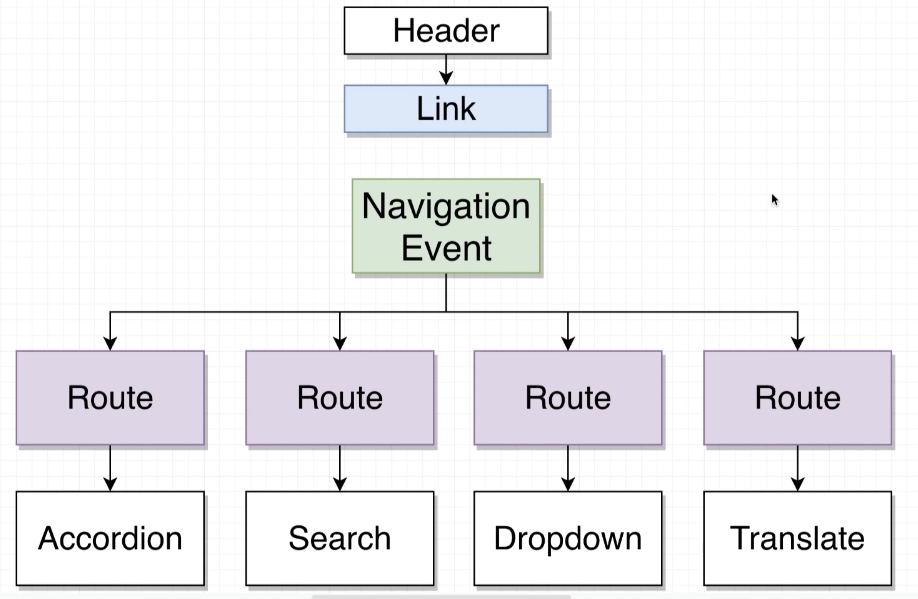

# Headers

Can make a very basic header with different URL routes.

```js
const Header = () => {
  return (
    <div className="ui secondary pointing menu">
      <a href="/" className="item">
        Accordion
      </a>
      <a href="/list" className="item">
        List
      </a>
      <a href="/dropdown" className="item">
        Dropdown
      </a>
      <a href="/translate" className="item">
        Translate
      </a>
    </div>
  );
};
```

Problem: Whenever we load a route, each component also reloads. This triggers an API request if the component has one. A bunch of network activity occurs just to load ONE component.

Ideally:
- User clicks on 'list'
- Change URL, but does not do a full page refresh.
- Each route could detect the URL has changed. 
- route could update piece of state tracking the current pathname
- each route rerenders, showing/hiding components appropriately. 



**window.history.pushState()** is a built in method that will change the URL, without reloading the page. 

```js
window.history.pushState({}, '', '/translate')
```
> Changes the URL to the `/translate` route, without reloading the page

This will change the URL, but NOT refresh the page. 

Code to 
```js
// Route.js
import React, { useState, useEffect } from 'react';

// create and show components with custom routes
// props will be the path and component we want to render
const Route = ({ path, children }) => {
  // useState to update our route
  const [currentPath, setCurrentPath] = useState(window.location.pathname);

  // event listener to listen for changes in the URL
  useEffect(() => {
    const handleRouteChange = () => {
      setCurrentPath(window.location.pathname);
    };
    // listen for changes in the URL
    window.addEventListener('popstate', handleRouteChange);

    // clean up event listener
    return () => {
      window.removeEventListener('popstate', handleRouteChange);
    };
  }, []);
  return currentPath === path ? children : null;
};

export default Route;

///////////////

// Header.js
import React from 'react';
import Link from './Link';

const Header = () => {
  return (
    <div className="ui secondary pointing menu">
      <Link href="/" className="item">
        Accordion
      </Link>
      <Link href="/list" className="item">
        List
      </Link>
      <Link href="/dropdown" className="item">
        Dropdown
      </Link>
      <Link href="/translate" className="item">
        Translate
      </Link>
    </div>
  );
};

export default Header;

///////////////

// Link.js
import React from 'react';

// component to trigger Navigation Event
// passed to each route, and appropriate component.

const Link = ({ className, href, children }) => {
  // prevent page reload, change URL, and navigate to new path
  const onClick = (event) => {
    event.preventDefault();
    window.history.pushState({}, '', href);

    const navEvent = new PopStateEvent('popstate');
    window.dispatchEvent(navEvent);
  };
  return (
    <a onClick={onClick} href={href} className={className}>
      {children}
    </a>
  );
};

export default Link;
```