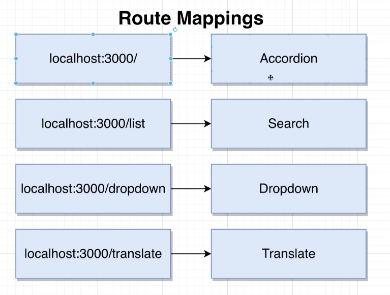
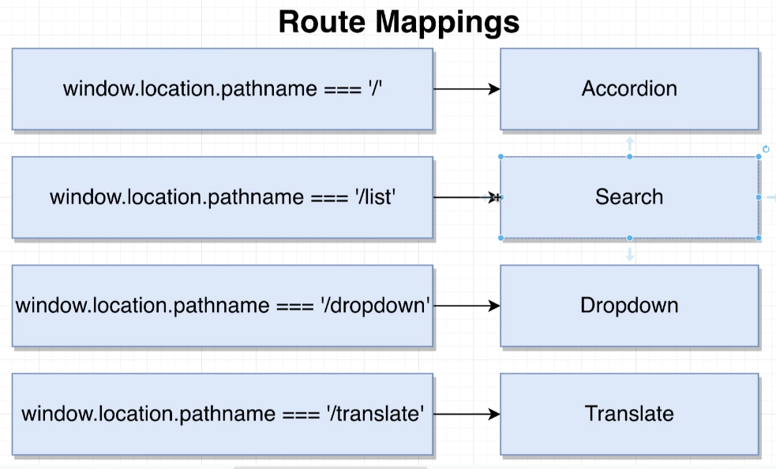
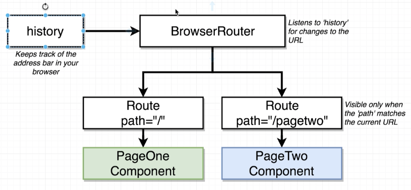
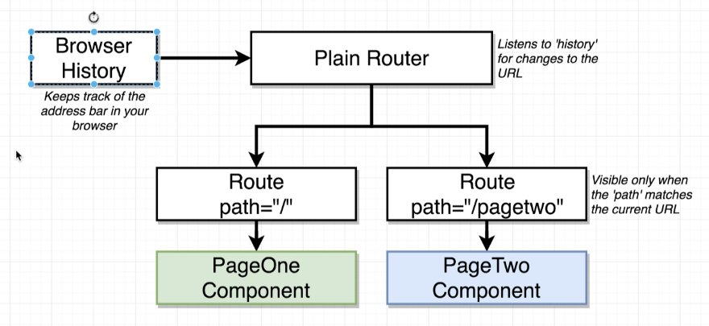

# Navigation

Showing different sets of components when the URL changes. 

Often make use of a popular library named ['React-Router'](https://reactrouter.com/docs/en/v6).
However...
- React router has frequent breaking changes.
- More important to learn the ideas and theory of navigation


Whenever we are at 'x' URL, show 'Y' component.

If you go to a desired URl (`http://localhost:3000/translate`), and then open console and type `window.location` and you will see the **`pathname`** property. Pathname is everything inside the URL except the origin.

## Route Mappings



Whenever `window.location.pathname === '/'` show the `Accordion` component. And so on.

Over in `App.js` file, we make the following changes:

```js
const App = () => {
  const [selected, setSelected] = useState(options[0]);

  const showAccordion = () => {
    if (window.location.pathname === '/') {
      return <Accordion items={items} />;
    }
  };

  const showList = () => {
    if (window.location.pathname === '/list') {
      return <Search />;
    }
  };

  const showDropdown = () => {
    if (window.location.pathname === '/dropdown') {
      return (
        <Dropdown
          options={options}
          selected={selected}
          onSelectedChange={setSelected}
        />
      );
    }
  };

  const showTranslate = () => {
    if (window.location.pathname === '/translate') {
      return <Translate />;
    }
  };

  return (
    <div>
      {showAccordion()}
      {showList()}
      {showDropdown()}
      {showTranslate()}
    </div>
  );
};

export default App;
```

**Downsides to this approach:**
- repetitive logic and code.

## Reusable Routes: Create Component for Routes

```js
import React from 'react';

// create and show components with custom routes
// props will be the path and component we want to render
const Route = ({ path, children }) => {
  return window.location.pathname === path ? children : null;
};

export default Route;
```
> Important you add the props names as **children**. This is because when you pass nested props (like in app.js), then get passed down as `children`.

```js
//app.js
const App = () => {
  const [selected, setSelected] = useState(options[0]);

  return (
    <div>
      <Route path="/">
            // here the props get passed down as children
        <Accordion items={items} />
      </Route>
      <Route path="/list">
        <Search />
      </Route>
      <Route path="/dropdown">
        <Dropdown
          options={options}    // here the props get passed down as children
          selected={selected}
          onSelectedChange={setSelected}
        />
      </Route>
      <Route path="/translate">
        <Translate />
      </Route>
    </div>
  );
};
```

# When to navigate users

Intentional Navigation: *user clicks on a `Link` component.*
Programmatic Navigation: *we run code to forcibly navigate the user through our app.*

Best Practice:
- User submits a form
- We make a request to backend API to create the stream
- some time passes...
- **API responds with success or error.**
- We wither show error to the user or navigate them back to list of streams.

# History References

[react-router-dom v5 docs on history:](https://v5.reactrouter.com/web/api/Router/history-object)



It can be difficult to get access to this history object, because the **BrowserRouter** creates it. 

Instead, we will create our **own [history object](https://v5.reactrouter.com/web/api/Router/history-object)**.



Will use a plain [**route** component.](https://v5.reactrouter.com/web/api/Route)

Can see [react-router-dom notes](https://github.com/Cwarcup/notes/blob/main/root/react/react-notes/react-router-dom.md#router-types) for better understanding of types of routers.

# Creating a Browser History Object

```js
import { createBrowserHistory } from 'history';   // gets installed with react-router-dom
export default createBrowserHistory();
```
> Will get a history object deprecation warning. Use the code below in your `history.js` file.

Inside you components App.js file, we need to import the history object, and update our [`Router`](https://v5.reactrouter.com/web/api/Router) component to use it.

```js
import React from 'react';
import { Router, Route } from 'react-router-dom';
import StreamCreate from './streams/StreamCreate';
import StreamEdit from './streams/StreamEdit';
import StreamDelete from './streams/StreamDelete';
import StreamList from './streams/StreamList';
import StreamShow from './streams/StreamShow';
import Header from './Header';
import history from '../history';    // <-- import history object

const App = () => {
  return (
    <div className="ui container">
      <Router history={history}>   // <-- change `BrowserRouter` to `Router` and pass in history object
        <div>
          <Header />
          <Route path="/" exact component={StreamList} />
          <Route path="/streams/new" exact component={StreamCreate} />
          <Route path="/streams/edit" exact component={StreamEdit} />
          <Route path="/streams/delete" exact component={StreamDelete} />
          <Route path="/streams/show" exact component={StreamShow} />
        </div>
      </Router>
    </div>
  );
};

export default App;
```

# Implementing Browser History Object and Programmatic Navigation

After creating the history object and changing the `BrowserRoute` to a plain [`Route`](https://v5.reactrouter.com/web/api/Router), we can use it to navigate the user.

In the arc/actions/index.js (where all the action creators are), we import the history object `import history from '../history';` and add the following line:
```js
export const createStream = (formValues) => async (dispatch, getState) => {
  const { userId } = getState().auth;
  const response = await streams.post('/streams', { ...formValues, userId }); 
  dispatch({ type: CREATE_STREAM, payload: response.data });

  // Do some programmatic navigation to get back to the root route
  history.push('/');     // <- call push() to navigate to a new URL to navigate the user
};
```

use `history.push('ROUTE_YOU_WANT_TO_NAVIGATE_TO')` to navigate the user to a new route.

# URL-based Selection

For example, user clicks a button, new route is rendered. But we need this new route to communicate information about the previous page. 

Example from StreamHub: When the logged in user clicks the 'edit' button to modify their stream, we need to communicate to the 'streams/edit' route which stream was clicked on.

We have two options:
1. **Selection Reducer**: When a user clicks on a stream to edit it, use a `selectionReducer` to record what stream is being edited.
2. **URL-based Selection**: Put the ID of the stream being edited in the URL.

If we want to use **URL-based selection**, we need to change our url paths to include the ID of the stream/edit path.

| Path                | Component    |
| ------------------- | ------------ |
| /                   | StreamList   |
| /streams/new        | StreamCreate |
| /streams/edit/:id   | StreamEdit   |
| /streams/delete/:id | StreamDelete |
| /streams/:id        | StreamShow   |

The `:id` is a placeholder for the ID of the stream. There is a dedicated path for each stream.

# Implementing URL-based Selection

1. Need to make sure when the 'edit' button is clicked, it updates the URL to the correct path with the correct stream ID.
2. Update routing information in components/App.js to ensure that whatever a user goes to '/streams/edit/:id' they see the correct stream.

For step 1: Within components/streams/StreamsList.js, we need to change the edit button.

  Current: using buttons.
```js
  renderAdmin(stream) {
    if (stream.userId === this.props.currentUserId) {
      return (
        <div className="right floated content">
          <button className="ui button primary">Edit</button>
          <button className="ui button negative">Delete</button>
        </div>
      );
    }
  }
```

We will want to use `Link` tags from react-router-dom to navigate user to a different page. Pass in the `stream/id` with a template literal. 
```js
  renderAdmin(stream) {
    if (stream.userId === this.props.currentUserId) {
      return (
        <div className="right floated content">
          <Link to={`/streams/edit/${stream.id}`} className="ui button primary">
            Edit
          </Link>
          <Link
            to={`/streams/delete/${stream.id}`}
            className="ui button negative"
          >
            Delete
          </Link>
        </div>
      );
    }
  }
```

Over in components/App.js, need to change our path so it understands that the id is being passed in.
[Docs on Route paths:](https://v5.reactrouter.com/web/api/Route/path-string-string)

```js
  const App = () => {
  return (
    <div className="ui container">
      <Router history={history}>
        <div>
          <Header />
          <Route path="/" exact component={StreamList} />
          <Route path="/streams/new" exact component={StreamCreate} />
          <Route path="/streams/edit/:id" exact component={StreamEdit} />  // <-- add :id to path
          <Route path="/streams/delete" exact component={StreamDelete} />
          <Route path="/streams/show" exact component={StreamShow} />
        </div>
      </Router>
    </div>
  );
};
```

## Route Params
For step 2: Communicate the ID in the URL to our component.

We can see the props being passed down to each component in the console.

```js
import React from 'react';

const StreamEdit = (props) => {
  console.log(props);
  return <div>StreamEdit</div>;
};

export default StreamEdit;

// history: {length: 11, action: 'POP', location: {…}, createHref: ƒ, push: ƒ, …}
// location: {pathname: '/streams/edit/3', search: '', hash: '', state: undefined, key: 'dzbpnu'}
// match:
//    isExact: true
//    params:
//      id: "3"
// [[Prototype]]: Object
// path: "/streams/edit/:id"
// url: "/streams/edit/3"
```

We get access to a params with an id that matches our id in `path="/streams/edit/:id"`.

You could even do something like `<Route path="/streams/edit/:anything/:somethingelse"`. If you then went to 'http://localhost:3000/streams/edit/dogs/australiandogs` you'd get back the following props.match.params:
  
  ```js
  {
    anything: 'dogs',
    somethingelse: 'australiandogs'
  }
  ```

