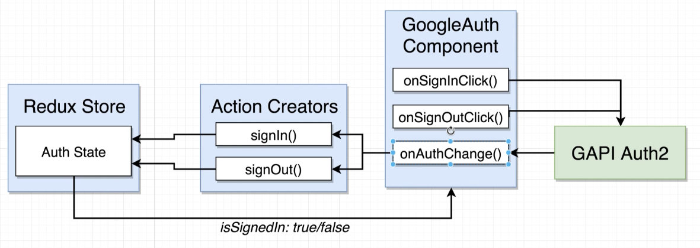

# OAuth Authentication

User authentication with an outside service provider (Google, Facebook, Linkedin, etc.). The user authorizes our app to access their information. The outside provider tells us about the user. We are trusting the provider to give us the user's information.

OAuth can be used for: 
1. User identification in an app.
2. Making actions on behalf of the user (i.e., get access to users email for filtering, calender access, etc.).

## Scopes

Give you access to different portions of a users account. 

[List of scopes:](https://developers.google.com/identity/protocols/oauth2/scopes)

For example, we most likely want to use [Google Sign-In](https://developers.google.com/identity/protocols/oauth2/scopes#google-sign-in).

## OAuth for Servers vs JavaScript Apps

| JS App                                  | Server                                                                    | use case                                             |
| --------------------------------------- | ------------------------------------------------------------------------- | ---------------------------------------------------- |
| YES                                     | YES                                                                       | generate 'token' so we can make request for the user |
| use when **user is logged in**          | used when **user is logged out**                                          | used when...                                         |
| Very easy to setup using Googles JS lib | Difficult to setup because we need to store a lot of data about the user. | Difficulty                                           |


# Flow for OAuth on Browser with Google Library

1. User clicks login with google button. Click event initiates OAuth process. 
2. Googles JS lib makes auth request to google. 
3. Google displays confirmation screen, user accepts. Pop up closes. 
4. Google JS lib invokes a callback in our React/Redux app.
5. Callback provides with 'authorization' token and profile for user. 

# Steps for Setting up OAuth
1. Create [new Google project](https://console.cloud.google.com/home/dashboard).
2. Setup an OAuth confirmation screen
3. Generates an Oauth Client ID
4. Install Googles API library, initialize it with the OAuth Client ID
   - `<script src="https://apis.google.com/js/api.js"></script>` inside head of main html file.
5. Make sure the lib gets called anytime the user clicks the login button.

# gapi

Docs for the Google API library: [gapi](https://developers.google.com/api-client-library/javascript/reference/referencedocs#gapiload) and [Auth Setup](https://developers.google.com/identity/sign-in/web/reference)

Getting started: [here](https://github.com/google/google-api-javascript-client/blob/master/docs/start.md#getting-started) 

```js
import React, { Component } from 'react';

export class GoogleAuth extends Component {
  componentDidMount() {
    window.gapi.load('client:auth2', () => { // loading the gapi
      window.gapi.client.init({ // initializing the gapi
        clientId:
          '604916494985-i5lp3u083o2cm90qv7tagn93blsjogha.apps.googleusercontent.com',
        scope: 'email',
      });
    });
  }
  render() {
    return <div>GoogleAuth</div>;
  }
}

export default GoogleAuth;
```

### Rendering Authentication Status

```js
export class GoogleAuth extends Component {
  state = { isSignedIn: null }; // we do not know if user is signed in or not.

  componentDidMount() {
    window.gapi.load('client:auth2', () => {
      window.gapi.client
        .init({ // returns a promise, we can call .then() on it.
          clientId:
            '604916494985-i5lp3u083o2cm90qv7tagn93blsjogha.apps.googleusercontent.com',
          scope: 'email',
        })
        .then(() => {
          this.auth = window.gapi.auth2.getAuthInstance(); // get auth instance
          this.setState({ isSignedIn: this.auth.isSignedIn.get() }); // set state
        });
    });
  }

  renderAuthButton() {
    if (this.state.isSignedIn === null) {
      return <div>I dont know if we are signed in</div>;
    } else if (this.state.isSignedIn) {
      return <div>I am signed in!</div>;
    } else {
      return <div> I am not signed in</div>;
    }
  }

  render() {
    return <div>{this.renderAuthButton()}</div>;
  }
}

export default GoogleAuth;
```

### Updating Auth State

```js
import React, { Component } from 'react';

export class GoogleAuth extends Component {
  state = { isSignedIn: null }; // we do not know if user is signed in or not.

  componentDidMount() {
    window.gapi.load('client:auth2', () => {
      window.gapi.client
        .init({
          clientId:
            '604916494985-i5lp3u083o2cm90qv7tagn93blsjogha.apps.googleusercontent.com',
          scope: 'email',
        })
        .then(() => {
          this.auth = window.gapi.auth2.getAuthInstance(); // get auth instance
          this.setState({ isSignedIn: this.auth.isSignedIn.get() }); // set state
          // listen for changes in auth status
          this.auth.isSignedIn.listen(this.onAuthChange);
        });
    });
  }

  // onAuthChange is called when auth status changes
  onAuthChange = () => {
    this.setState({ isSignedIn: this.auth.isSignedIn.get() });
  };

  // render auth button
  renderAuthButton() {
    if (this.state.isSignedIn === null) {
      return <div>I dont know if we are signed in</div>;
    } else if (this.state.isSignedIn) {
      return <div>I am signed in!</div>;
    } else {
      return <div> I am not signed in</div>;
    }
  }

  render() {
    return <div>{this.renderAuthButton()}</div>;
  }
}

export default GoogleAuth;
```

# Redux Architecture Design with OAuth



## Redux Setup

Add `connect` from react-redux to the top of the component.

Add connect method at bottom of page `export default connect(null, { signIn, signOut })(GoogleAuth);`

