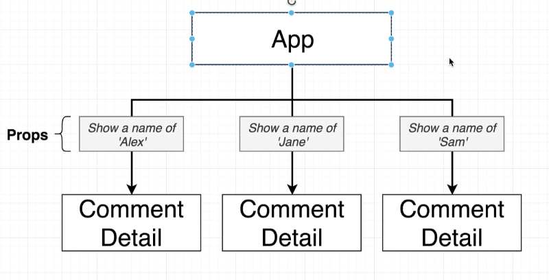

# Props

Basic example of how to use props. For example, this code renders “Hello, Sara” on the page:
```js
function Welcome(props) {
  return <h1>Hello, {props.name}</h1>;
}

const element = <Welcome name="Sara" />;
ReactDOM.render(
  element,
  document.getElementById('root')
);
```

Component Hierarchy
- `App` is the **parent** to `CommentDetail`
```js
const App = () => {
  return (
    <div className="ui container comments">
      <CommentDetail />
      <CommentDetail />
    </div>
  );
};
```

---

Props are a system for passing data from a **parent** component to a **child**.
The overall goal is to **customize or configure** a child component.



There is no limit on the amount of information we can pass through props. 

# Passing Through Props
- a child can NOT pass data through the props system directly. 
  - generally about parent communicating to the child.

**Providing a prop to a child**


Can also reference some javascript variable.
```js
// in parent component
const App = () => {
  return (
    <div className="ui container comments">
      <CommentDetail
        author={faker.name.findName()}
        text={faker.lorem.sentence()}
        timeAgo="Sun at 4:05PM"
      />
      <CommentDetail
        author={faker.name.findName()}
        text={faker.lorem.sentence()}
        timeAgo="Tues at 7:33PM"
      />
      <CommentDetail
        author={faker.name.findName()}
        text={faker.lorem.sentence()}
        timeAgo="Fri at 4:20PM"
      />
    </div>
  );
};
```

Must add the **props** as a parameter in the component.
```js
//in the child component
import React from 'react';
import faker from '@faker-js/faker';

const CommentDetail = (props) => {
  return (
    <div className="comment">
      <a href="/" className="avatar">
        
      </a>
      <div className="content">
        <a href="/" className="author">
          {props.author}
        </a>
        <div className="metadata">
          <span className="date">{props.timeAgo}</span>
        </div>
        <div className="text">{props.text}</div>
      </div>
    </div>
  );
};

export default CommentDetail;
```

# Showing Custom Children - reusable components

You can pass a child into a prop like so:
```js
const ApprovalCard = (props) => {
  return (
    <div className="ui cards">
      <div className="card">
        <div className="content">
          {props.children}           // add child
          <div className="extra content">
            <div className="ui two buttons">
              <div className="ui basic green button">Approve</div>
              <div className="ui basic red button">Reject</div>
            </div>
          </div>
        </div>
      </div>
    </div>
  );
};
```
Can then pass the desired child as an argument inside the parent:
```js
const App = () => {
  return (
    <div className="ui container comments">

      <ApprovalCard>    // parent

        <CommentDetail    // child 
          avatarImg={faker.image.avatar()}
          author={faker.name.findName()}
          text={faker.lorem.sentence()}
          timeAgo="Sun at 4:05PM"
        />
      </ApprovalCard>
    </div>
  );
};
```

We take a **child**, wrap it in a **parent component**. The child component will show up on the ` {props.children}`. We can then reference that child anywhere in the parent component. 

If we want to make our components re-usable, we **must** have `{props.children}` somewhere in the **parent component**. 
```js
<div className="content">{props.children}</div>
```
---
One last basic props example:
```js
    const App = () => {
        return (
            <div>
                <Message 
                headerText="Changes in Service"
                paraText="We just updated our privacy policy here to better service our customers."
                />
            </div>
        );
    }
    
    const Message = (props) => {
        return (
            <div className="ui message">
                <div className="header">{props.headerText}</div>
                <p>{props.paraText}</p>
            </div>
        );
    }
```

# Default Props

```js
// in app.js
//set a specific message
<Loader message={'Please approve location services'} />
//loader.js
export default class Loader extends Component {
  render() {
    return (
      <div class="ui active dimmer">
        <div class="ui massive text loader">
          {this.props.message}
        </div>
      </div>
    );
  }
}
// 

// no message specified
// default message will be displayed
//app.js
return <Loader />;
//loader.js
export default class Loader extends Component {
  render() {
    return (
      <div class="ui active dimmer">
        <div class="ui massive text loader">
          {this.props.message || 'Loading'}
        </div>
      </div>
    );
  }
}

//OR written as a functional component

import React from 'react';

const Loader = (props) => {
  return (
    <div class="ui active dimmer">
      <div class="ui massive text loader">{props.message}</div>
    </div>
  );
};

Loader.defaultProps = { message: 'Loading...' };

export default Loader;
```

# Callbacks in Children

Whenever we are invoking a `porp` within a class, we must refer to it using `this.props`.
Like so:
```js
//in child
class SearchBar extends React.Component {
  state = { term: '', placeholder: 'Search' };

  onFormSubmit = (event) => {
    event.preventDefault();
    this.props.onSubmit(this.state.term); //passing props to parent
  };

  render() {
    return (
      <div className="ui segment">
        <form onSubmit={this.onFormSubmit} className="ui form">
          <div className="field">
            <label>Image Search</label>
            <input
              type="text"
              value={this.state.term}
              onChange={(e) => this.setState({ term: e.target.value })}
              placeholder={this.state.placeholder}
            ></input>
          </div>
        </form>
      </div>
    );
  }
}

//in parent
class App extends React.Component {
  onSearchSubmit(term) {
    console.log(term);
  }

  render() {
    return (
      <div className="ui-container" style={{ marginTop: '10px' }}>
        <SearchBar onSubmit={this.onSearchSubmit} /> // have our child component and send it props this way
      </div>
    );
  }
}
```