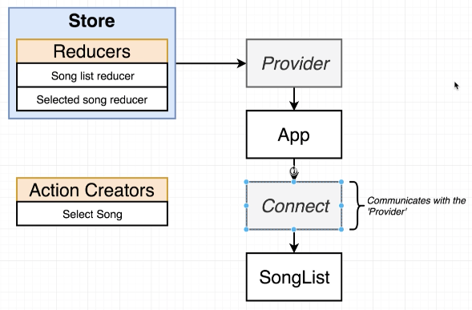
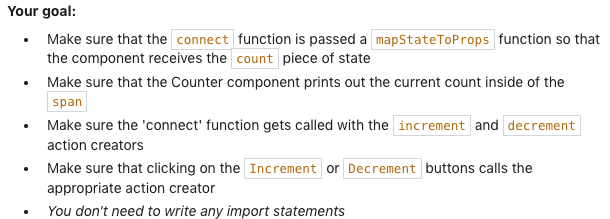

# React-Redux

### Sections:
- [How Redux works](https://github.com/Cwarcup/notes/blob/main/root/typescript/README.md#projects)
- [App Structure](https://github.com/Cwarcup/notes/blob/main/root/react/react-notes/react-redux.md#app-structure)
- [Providers](https://github.com/Cwarcup/notes/blob/main/root/react/react-notes/react-redux.md#wire-up-our-provider)
- [Connect Component](https://github.com/Cwarcup/notes/blob/main/root/react/react-notes/react-redux.md#connect-component)
- [mapStateToProps](https://github.com/Cwarcup/notes/blob/main/root/react/react-notes/react-redux.md#mapstatetoprops)
- [Summary](https://github.com/Cwarcup/notes/blob/main/root/react/react-notes/react-redux.md#take-away)

npm docs on react-redux: [here](https://www.npmjs.com/package/react-redux)

# How React-Redux Works

Using React-Redux, we wll create two new components: **Provider** and **Connect**. These are both created by React-Redux. We will create **instances** of these components in our application, and pass some **props** to **both of them**.



The 'store' gets passed on as a prop to the **provider**. The provider is a component that is responsible for providing the 'store' to all of our components.

**Connect Component**:
Is special because it directly communicates with the `Provider` at the top of our hierarchy. It does not communicate through the props system, but through the **context system**. Essentially it is a special system that allows any parent component to communicate with any child component, even if they have another component between them.

# App Structure

- /src
  - /action 
    - Contains files related to action creators.
    - creates an action (JavaScript object).
    - often named `index.js` so we can just call `import actions from '../actions';`. Is easier for webpack to handle as it is a single file.
  - /components
    - Contains files related to components.
  - /reducers
    - Contains files related to reducers.
    - Receive, change, and return state.
    - often named `index.js` so we can just call `import reducers from '../reducers';`. Is easier for webpack to handle as it is a single file.
  - index.js
    - sets up both the react and redux sides of the app.

Example action creator:
```js
// Action creators

export const selectSong = (song) => {
  // return an action
  return {
    type: 'SONG_SELECTED',
    payload: song
  }
}
```

Example reducer:
```js
// reducing functions
import { combineReducers } from 'redux';

// song list reducer: returns a static list of songs
const songsReducer = () => {
  return [
    { title: 'No Scrubs', duration: '4:05' },
    { title: 'Macarena', duration: '2:30' },
    { title: 'All Star', duration: '3:15' },
    { title: 'I Want it That Way', duration: '1:45' },
  ];
};

// selected song reducer: returns the selected song
const selectedSongReducer = (selectedSong = null, action) => {
  if (action.type === 'SONG_SELECTED') {
    return action.payload;
  }

  return selectedSong;
};

// will pass in an object. The keys of our object will be the keys that show up in our state object.
export default combineReducers({
  songs: songsReducer,
  selectedSong: selectedSongReducer,
});
```

## Wire up our Provider
Within main `index.js`:
```js
import React from 'react';
import ReactDOM from 'react-dom';
import { Provider } from 'react-redux';
import { createStore } from 'redux';

import App from './components/App';
import reducers from './reducers';

ReactDOM.render(
  <Provider store={createStore(reducers)}>
    <App />
  </Provider>,
  document.getElementById('root')
);
```

## Connect Component

Will only need to be created in our various **components** because it needs to reach up into the Provider to get the store.

```js
import React, { Component } from 'react';
import { connect } from 'react-redux';

class SongList extends Component {
  render() {
    return <div>SongList</div>;
  }
}

export default connect()(SongList);
```

**Connect() Syntax**

```js
function connect() {
  return function() {
  	return 'Hi there!'
  }
}

connect() // nothing returned

connect()() // 'Hi there!'
```

### mapStateToProps

Is saying we are going to take our state object, essentially all of the data that's inside our reduce store, and then we are going to map it to our props.

This could be called anything, but we will call it `mapStateToProps` by convention. 

```js
import React, { Component } from 'react';
import { connect } from 'react-redux';

class SongList extends Component {
  render() {
    return <div>SongList</div>;
  }
}

const mapStateToProps = (state) => {
  console.log(state);
  return state;
};

export default connect(mapStateToProps)(SongList);
```

the state returns:
```
selectedSong: null
songs: Array(4)
0: {title: 'No Scrubs', duration: '4:05'}
1: {title: 'Macarena', duration: '2:30'}
2: {title: 'All Star', duration: '3:15'}
3: {title: 'I Want it That Way', duration: '1:45'}
```

We are only interested in the songs array, so we can just return the songs array.
```js
const mapStateToProps = (state) => {
  return { songs: state.songs };
};
```

If wanted to now use this array of songs, it will be found in `this.props`.

For the **connect component**, we will always:
- import the connect function from react-redux 
```js
import { connect } from 'react-redux';
```
- call `connect` and pass in the mapStateToProps as the first argument, and our component as the second argument.
```js
export default connect(mapStateToProps)(SongList);
```
- define the mapStateToProps function with the first argument being the state object, and return an **object**  that will be passed as props to our component.
```js
const mapStateToProps = (state) => {
  return { songs: state.songs }; // will be passed as props in our component
};
```

# Take Away

1. We are still going to create components like we usually do in react. 

2. If we need to make changes to our state or receive information, we are going to **import the connect function** from react-redux.

3. At the bottom of our component, we can define a **`mapStateToProps`** function that will return an object that will be passed as props to our component.
    - first argument is `mapStateToProps`
    - second function call is the **component** you want to **receive the props**.
    - `export default connect(mapStateToProps)(SongDetail);`
    - Can also accept **action creators** as the first argument.
      - `export default connect(mapStateToProps, { selectSong: selectSong })(SongList);`

Example Exercise:


```js
// Action Creators
const increment = () => ({ type: 'increment' });
const decrement = () => ({ type: 'decrement' });


// component: accepts `props` created by the mapStateToProps function
const Counter = (props) => {
   return (
       <div>
           <button className="increment" onClick={props.increment}>Increment</button>
           <button className="decrement" onClick={props.decrement}>Decrement</button>
           Current Count: <span>{props.count}</span>
       </div>
   );
};

// create mapStateToProps function so we can return a prop to the counter component

const mapStateToProps = (state) => {
   return { count: state.count };
};

// connect() with args mapStateToProps, and the actionCreators (increment, decrement)

const WrappedCounter = ReactRedux.connect(mapStateToProps, { increment, decrement})(Counter);

// Only change code *before* me!
// -----------

const store = Redux.createStore(Redux.combineReducers({
   count: (count = 0, action) => {
       if (action.type === 'increment') {
           return count + 1;
       } else if (action.type === 'decrement') {
           return count - 1;
       } else {
           return count;
       }
   }
}));

ReactDOM.render(
   <ReactRedux.Provider store={store}>
       <WrappedCounter />
   </ReactRedux.Provider>, 
   document.querySelector('#root')
);

```