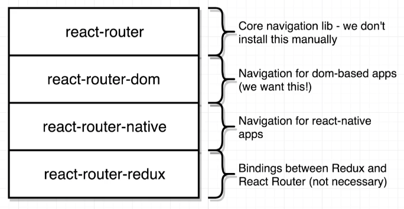
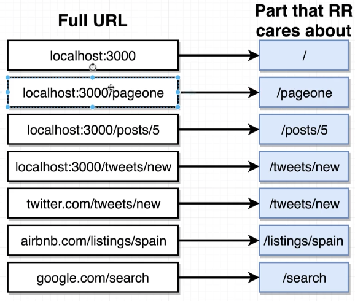
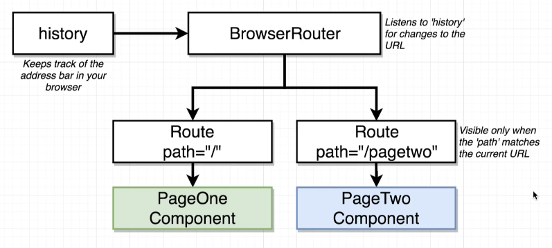

# React Router DOM

[also see notes from navigation:](https://github.com/Cwarcup/notes/blob/main/root/react/react-notes/navigation.md)
- [URl based selection](https://github.com/Cwarcup/notes/blob/main/root/react/react-notes/navigation.md#url-based-selection)
- [Route Params](https://github.com/Cwarcup/notes/blob/main/root/react/react-notes/navigation.md#route-params)


> Code below will be written with react-router v5.

```
npm install react-router-dom@5
```

[Github Page](https://github.com/remix-run/react-router/tree/v5)

## About React Router DOM



## Connect the URL

[Docs here:](https://v5.reactrouter.com/web/guides/quick-start/1st-example-basic-routing)

First things first, we want to connect your app to the browser's URL: import BrowserRouter and render it around your whole app.

```js
import React from 'react';
import { BrowserRouter, Route } from 'react-router-dom';

const PageOne = () => {
  return <div>PageOne</div>;
};

const PageTwo = () => {
  return <div>PageTwo</div>;
};

const App = () => {
  return (
    <div>
      <BrowserRouter>
        <div>
          <Route path="/" exact component={PageOne} />
          <Route path="/pagetwo" component={PageTwo} />
        </div>
      </BrowserRouter>
    </div>
  );
};

export default App;
```
> In address bar can do to 'http://localhost:3000/pagetwo' and view the page.

React router only cares about the **pathname**, so we can use the path prop to specify the path. Everything **after** the port and main domain.



## How React-Router Works



---

## Navigation - Routes

BAD Navigation:
- using `<a>` tags with href='/pagetwo' and user clicks on it causes the browser to load the page, dropping the old HTML file, including all your **react/redux state data!**.
- this is normal operation for a browser, but we do NOT want this for a react app. 

GOOD Navigation:
- using react-router-dom, we can use the `Link` component to create a link that will navigate to a different page.
- use `to` prop to specify the path instead of `href`.

```js
import React from 'react';
import { BrowserRouter, Route, Link } from 'react-router-dom';

const PageOne = () => {
  return (
    <div>
    // GOOD! using Link instead of <a> tags
      <Link to="/pagetwo">Link to page two</Link>
    </div>
  );
};

const PageTwo = () => {
  return (
    <div>
      PageTwo
      // BAD!!!!
      <a href="/">Navigate to page one</a>
    </div>
  );
};

const App = () => {
  return (
    <div>
      <BrowserRouter>
        <div>
          <Route path="/" exact component={PageOne} />
          <Route path="/pagetwo" component={PageTwo} />
        </div>
      </BrowserRouter>
    </div>
  );
};
```

### Router Types

[Video here](https://www.udemy.com/course/react-redux/learn/lecture/12700551#content)

**BrowserRouter**:
- uses everything after the top level domain (TLD) (.com, .net) or port as the `path`.

  `localhost:3000/pagetwo` will be `/pagetwo`

**HashRouter**:
- uses everything after a `#` as the `path`.

  `localhost:3000/#/pagetwo` will be `/pagetwo`

**MemoryRouter**:
- doesn't use the URL to track navigation.
- URL will NOT change.

## Wiring up routes

```js
import React from 'react';
import { BrowserRouter, Route, Link } from 'react-router-dom';
import StreamCreate from './streams/StreamCreate';
import StreamEdit from './streams/StreamEdit';
import StreamDelete from './streams/StreamDelete';
import StreamList from './streams/StreamList';
import StreamShow from './streams/StreamShow';

const App = () => {
  return (
    <div>
      <BrowserRouter>
        <div>
          <Route path="/" exact component={StreamList} />
          <Route path="/steams/new" exact component={StreamCreate} />
          <Route path="/steams/edit" exact component={StreamEdit} />
          <Route path="/steams/delete" exact component={StreamDelete} />
          <Route path="/steams/show" exact component={StreamShow} />
        </div>
      </BrowserRouter>
    </div>
  );
};

export default App;
```
## Links Inside Routers

Will run into an error if you try to use `Link` outside of a BrowserRouter.

```js
const App = () => {
  return (
    <div className="ui container">
      <BrowserRouter> // must be inside BrowserRouter
        <div>
          <Header />
          <Route path="/" exact component={StreamList} />
          <Route path="/steams/new" exact component={StreamCreate} />
          <Route path="/steams/edit" exact component={StreamEdit} />
          <Route path="/steams/delete" exact component={StreamDelete} />
          <Route path="/steams/show" exact component={StreamShow} />
        </div>
      </BrowserRouter>
    </div>
  );
};
```

# Component Isolation with React Router

With React-router, each component needs to be designed to work in isolation (**fetch its own data!**). If this is not done, you may load a page, but the data will not be there because a different component was used to initially fetch that data. 

For example, that StreamList components uses `componentDidMount() {this.props.fetchStreams();}` to fetch the data when it is first rendered, and updates Redux store. If you navigate from this page to the StreamEdit page, you get the data, because it is in the Redux store. However, if you did not initially go to the StreamsList page, you will not have the data for the StreamEdit page. The store was not updated, so the StreamEdit page will not have the data.

## Component fetching own data

Turn the function based component into a class based component so you can use `componentDidMount()` to fetch the data.

```js
class StreamEdit extends Component  {
  componentDidMount() {
    this.props.fetchStream(this.props.match.params.id);
  }
  render() {
    return (
      <div>
        StreamEdit
      </div>
    );
  }
};

//...

export default connect(mapStateToProps, { fetchStream })(StreamEdit);
```

# Setting Initial Values

uses Redux Form to set initial values for the form.

use the `initialValues` prop to set the initial values of the form.

syntax:


```js
render() {
    if (!this.props.stream) {
      return <div className="ui small inline active loader"></div>;
    }
    return (
      <div>
        <h3>Edit a Stream</h3>
        <StreamForm
          initialValues={{
            title: this.props.stream.title,
            description: this.props.stream.description,
          }}
          onSubmit={this.onSubmit}
        />
      </div>
    );
  }
```