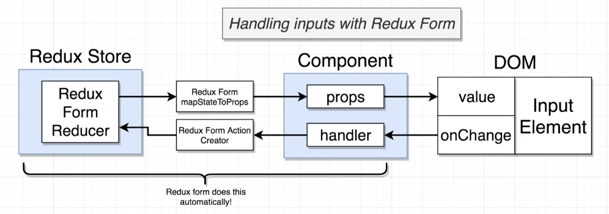

# Redux Form

[Official site](https://redux-form.com/8.3.0/) and [github page](https://github.com/redux-form/redux-form):

[Useful redux-form examples:](https://redux-form.com/8.2.1/examples/)

Can refactor to use [React Final](https://final-form.org/react/) Form with [these notes](https://www.udemy.com/course/react-redux/learn/lecture/26637172#questions):

Install redux-form:
```
npm install redux-form --legacy-peer-deps
```
> Need to use older version if using Node v15 and npm v7.



Input element gets assigned a value and onChange event in the DOM.

Some **reducer** will hold the state of our different forms in our app (selection of a drop down, check boxes in our app, etc). All this will be maintained by a reducer. 

To ensure we can get the data from the store into our elements in our form, we use `mapStateToProps` to send this data to our **component** as a **prop**. 

The **component** will then use props data to render the form, which gets displayed on the DOM. 

Then anytime a user makes a change to our element on the DOM, we use `onChange` to communicate to the component, which calls some **action creator** to create an action, thus updating the **Redux Store** form data. 

# Getting Started

[Official documentation:](https://redux-form.com/8.2.1/docs/gettingstarted.md/#basic-usage-guide)

## Form Reducer

Need to wire up a reducer to our form: Is already created by redux-form, just need to import it. 

Need to pass formReducer under 'form' key:
```js
import { combineReducers } from 'redux';
import { reducer as formReducer } from 'redux-form'; // import
import authReducer from './authReducer';

export default combineReducers({
  auth: authReducer,
  form: formReducer // add key form reducer
});
```
> can rename the reducer to something else, such as `formReducer` by doing this: `import { reducer as formReducer } from 'redux-form';`

## Form Component

Example code:
```js
import React from 'react'
import { Field, reduxForm } from 'redux-form'

let ContactForm = props => {
  const { handleSubmit } = props
  return <form onSubmit={handleSubmit}>{/* form body*/}</form>
}

ContactForm = reduxForm({
  // a unique name for the form
  form: 'contact'
})(ContactForm)

export default ContactForm
```

Example code from Stream app:
```js
import React, { Component } from 'react';
import { Field, reduxForm } from 'redux-form';

class StreamCreate extends Component {   // this gets passed a ton of props now
  render() {
    console.log(this.props);
    return <div>StreamCreate</div>;
  }
}
      // add reduxForm
export default reduxForm({ 
  form: 'streamCreateForm' // a unique name for the form
})(StreamCreate);
```

### Form `<Field/>` Components

We use this anytime we want to get some input from a user.

Name property is ALWAYS required. 

The `<Field/>` component connects each input to the store. The basic usage goes as follows:

```js
<Field name="inputName" component="input" type="text" />
```

> It creates an HTML `<input/>` element of type text. It also passes additional props such as value, onChange, onBlur, etc. Those are used to track and maintain the input state under the hood.

That being said, a `<Field/>` component does NOT actually responsible for getting anything to show up on the screen. The `<Field/>` component does not know how to render a dropdown, or text input. 


```js
import React, { Component } from 'react';
import { Field, reduxForm } from 'redux-form';

class StreamCreate extends Component {
  render() {
    return (
      <form>
        <Field name="title" />
        <Field name="description" />
      </form>
    );
  }
}

export default reduxForm({
  form: 'streamCreateForm', // a unique name for the form
})(StreamCreate);
```
> Will get an error here 'Warning: Failed prop type: Invalid prop `component` supplied to `Field`.` 

**Need to add the element `component=" "` which will actually render the component.**

```js
import React, { Component } from 'react';
import { Field, reduxForm } from 'redux-form';

class StreamCreate extends Component {


  renderInput(formProps) {     // create helper function for the component
    console.log(formProps);   // formProps gives us a ton of different methods
    return (
      <input
        onChange={formProps.input.onChange}
        value={formProps.input.value}
      />
    );
  }
  render() {
    return (
      <form>
        <Field name="title" component={this.renderInput} />  // add component
        <Field name="description" component={this.renderInput} />
      </form>
    );
  }
}

export default reduxForm({
  form: 'streamCreateForm', // a unique name for the form
})(StreamCreate);
```

This is how we pass data to our store. Every time we type into the form fields now, it updates our redux store values. Can be seen in redux dev tools. 

There's a shorter way to do this:

```js
class StreamCreate extends Component {
  renderInput(formProps) {
    return <input {...formProps.input} />;
  }
  render() {
    return (
      <form>
        <Field name="title" component={this.renderInput} />
        <Field name="description" component={this.renderInput} />
      </form>
    );
  }
}

//or destructuring the formProps

class StreamCreate extends Component {
  renderInput({ input }) {
    return <input {...input} />;
  }
  render() {
    return (
      <form>
        <Field name="title" component={this.renderInput} />
        <Field name="description" component={this.renderInput} />
      </form>
    );
  }
}
```

## Customizing the `<Field/>` 

Can have additional elements being returned in the `<Field/>` component. can do this by adding an element within the `<Field/>`, and then returning that element as a prop in the method.

```js
class StreamCreate extends Component {
  renderInput({ input, label }) {    // 2. pass new element as a prop
    return (
      <div className="field">
        <label>{label}</label>    // 3. add the label as JSX.
        <input {...input} />
      </div>
    );
  }
  render() {
    return (
      <form>
        <Field
          name="title"
          component={this.renderInput}
          label="Enter Tittle "    // 1. create new element
        />
        <Field
          name="description"
          component={this.renderInput}
          label="Enter Description "
        />
      </form>
    );
  }
}
```

# Handling Form Submission

Remember, forms are used to get data from the user. We need to handle the submission of the form.

We pass `onSubmit={this.props.handleSubmit(this.onSubmit)}` on the `form` tag in our render() method. We pass in any method we want within the `handleSubmit` prop, which will get executed when the form is submitted with the button.

```js
class StreamCreate extends Component {
  renderInput({ input, label }) {
    return (
      <div className="field">
        <label>{label}</label>
        <input {...input} />
      </div>
    );
  }

  onSubmit(formValues) {   // function to handle submit
    console.log(formValues);
  }

  render() {
    return (
      <form
        onSubmit={this.props.handleSubmit(this.onSubmit)}  // pass onSubmit method to handleSubmit
        className="ui form"
      >
        <Field
          name="title"
          component={this.renderInput}
          label="Enter Tittle "
        />
        <Field
          name="description"
          component={this.renderInput}
          label="Enter Description "
        />
        <button className="ui button primary">Submit</button>
      </form>
    );
  }
}
```

# Validating Form Inputs

[Supporting documentation:](https://redux-form.com/8.2.1/examples/syncvalidation/)

Create a validation function that takes in `formValues` prop, and uses a series of if statements.

If all inputs are valid (i.e. passes all `if` statements) then the validation function returns an empty object. 

If an error occurs, each invalid field will have a key of the field **NAME**, and the value will be the **error message**. Redux-form will rerender our component and show the error message.

Example validate function:
```js
const validate = (formValues) => {

  const errors = {};   // create empty errors object

  // no title
  if (!formValues.title) {
    errors.title = 'You must enter a title';
  }
  // no description
  if (!formValues.description) {
    errors.description = 'You must enter a description';
  }

  return errors;  // return empty errors object if no errors
};
```

### Connect Validator to Redux Form

Add the validate function in the `reduxForm` function like so:

```js
export default reduxForm({
  form: 'streamCreateForm',    // a unique identifier for this form
  validate: validate,   //   <--- validation function given to redux-form
})(StreamCreate);
```


### Displaying Validation Message

Each `Field` is rerendered with the error message from the `errors` object. 

In order to get the error message to render in the `<Field/>` component, we need to pass in the `meta` prop AND ensure the **name** matches the error key.

```js
class StreamCreate extends Component {
  // creates a field for the form
  // passed to the form as a prop
  renderInput({ input, label, meta }) {
    return (
      <div className="field">
        <label>{label}</label>
        <input {...input} />
        <div>{meta.error}</div>
      </div>
    );
  }
  ```

### Showing Errors on Touch

Want to only submit the error message when the user clicks out of the field. 

1. Need to create a new function called `renderError` that takes in the `meta` prop.
    - Can desconstruct the `meta` prop to get the `touched` and `error` props.
    - Will return JSX to display the error.
2. Need to add the `meta` props in the `renderInput` function to actually display the newly created `renderError` function.
3. Need to change `renderInput` into an arrow function because we are passing it to the `render()` function using `this.renderInput`.

```js
class StreamCreate extends Component {
  renderInput = ({ input, label, meta }) => {   // 2. add meta prop
    return (
      <div className="field">
        <label>{label}</label>
        <input {...input} autoComplete="off" />
        {this.renderError(meta)}     //   <--- 3. add renderError function
      </div>
    );
  };

  renderError({ error, touched }) {    // 1. create new function
    if (touched && error) {
      return (
        <div className="ui error message">
          <div className="header">{error}</div>
        </div>
      );
    }
  }

  onSubmit(formValues) {
    console.log(formValues);
  }

  render() {
    return (
      <form
        onSubmit={this.props.handleSubmit(this.onSubmit)}
        className="ui form"
      >
        <Field
          name="title"
          component={this.renderInput}
          label="Enter Tittle "
        />
        <Field
          name="description"
          component={this.renderInput}
          label="Enter Description "
        />
        <button className="ui button primary">Submit</button>
      </form>
    );
  }
}
```

Can also get fancy with semantic UI and have the entire field turn red when the error occurs:
```js
  renderInput = ({ input, label, meta, touched }) => {
    const className = `field ${meta.error && meta.touched ? 'error' : ''}`; // if true then add error class
    return (
      <div className={className}>   // pass in className
        <label>{label}</label>
        <input {...input} autoComplete="off" />
        {this.renderError(meta)}
      </div>
    );
  };
  //...
```

# Using Redux Form with Redux - connect() and reduxForm()

May run into an issue where we have a component that utilizes redux-form, but we need to wire up an action creator. 

For example, here we have a component that exports reduxForm, but we also need to use the connect() function to communicate with our provider. 

```js
export default reduxForm({
  form: 'streamCreateForm', // a unique name for the form
  validate: validate, // validate function
})(StreamCreate);
```

Can wrap our `reduxForm` in a separate function called `formWrapped`, and then export `connect()` with `formWrapped`:
```js
const formWrapped = reduxForm({
  form: 'streamCreateForm', // a unique name for the form
  validate: validate, // validate function
})(StreamCreate);

export default connect(null, { createStream })(formWrapped);
```

# Selecting Records from State

Using [10-streams](https://github.com/Cwarcup/react-with-redux/tree/88bd99d2f5a107e183db28766b2cc71dac0c0e32/10-streams) as an example:

Remember, we can see the props being passed down to each component in the console.

```js
import React from 'react';

const StreamEdit = (props) => {
  console.log(props);
  return <div>StreamEdit</div>;
};

export default StreamEdit;

// history: {length: 11, action: 'POP', location: {…}, createHref: ƒ, push: ƒ, …}
// location: {pathname: '/streams/edit/3', search: '', hash: '', state: undefined, key: 'dzbpnu'}
// match:
//    isExact: true
//    params:
//      id: "3"
// [[Prototype]]: Object
// path: "/streams/edit/:id"
// url: "/streams/edit/3"
```

We get access to a params with an id that matches our id in `path="/streams/edit/:id"`.

You could even do something like `<Route path="/streams/edit/:anything/:somethingelse"`. If you then went to 'http://localhost:3000/streams/edit/dogs/australiandogs` you'd get back the following props.match.params:
  
  ```js
  {
    anything: 'dogs',
    somethingelse: 'australiandogs'
  }
  ```

We want access to the props object on the edit page, and the list of streams inside the state store. 

### Get information from redux store
In order to get information out of the **redux store,** we need to use the [`connect()` function.](https://react-redux.js.org/using-react-redux/connect-mapstate)

1. import the `connect()` function from `react-redux`
   ```js
   import { connect } from 'react-redux';
   ```
2. setup `mapStateToProps` [function](https://react-redux.js.org/using-react-redux/connect-mapstate#defining-mapstatetoprops)
   ```js
   mapStateToProps(state, ownProps) {
     return {
       stream: state.streams[ownProps.match.params.id]
     };
   }
   ```
3. dispatch - add connect() at the bottom, and pass in the `mapStateToProps` function. Include your component as the second argument.
  ```js
   export default connect(mapStateToProps)(StreamEdit);
  ```

Basic syntax:
```js
import { connect } from 'react-redux';  // import statement

const myComponent = (props) => {
  return <div>Component JSX</div>;
};

const mapStateToProps = (state, ownProps) => {  
  return {} // return object
};
// state is the redux store, passed to component as props
// ownProps is optional, 
// return a plain object containing the data that the connected component needs

export default connect(mapStateToProps)(myComponent);

```
> [about the arguments state and ownProps:](https://react-redux.js.org/using-react-redux/connect-mapstate#arguments)

For our example:
```js
import React from 'react';
import { connect } from 'react-redux';

const StreamEdit = (props) => {
  console.log('props', props);
  return <div>StreamEdit</div>;
};

const mapStateToProps = (state, ownProps) => {
  return { stream: state.streams[ownProps.match.params.id] }; // props will now contain a stream property, with the stream we want to edit.
};
export default connect(mapStateToProps)(StreamEdit);
```

# Setting Initial Values

uses Redux Form to set initial values for the form.

[official docs:](https://redux-form.com/8.2.1/examples/initializefromstate/)

use the [`initialValues`](https://redd.gitbook.io/react-advanced-form/components/form/props/initial-values) prop to set the initial values of the form.

syntax:
```js
initialValues={{ nameOfPropertyInField: 'value' }}
```

```js
// within StreamEdit.js - parent component
render() {
    if (!this.props.stream) {
      return <div className="ui small inline active loader"></div>;
    }
    return (
      <div>
        <h3>Edit a Stream</h3>
        <StreamForm
          initialValues={{
            title: this.props.stream.title,
            description: this.props.stream.description,
          }}
          onSubmit={this.onSubmit}
        />
      </div>
    );
  }
```

Within the `initialValues={{}}` object, need to ensure the property names match the name of the field in the form. Like so:
```js 
// within StreamForm.js - child component to StreamEdit.js
  render() {
    return (
      <form
        onSubmit={this.props.handleSubmit(this.onSubmit)}
        className="ui form error"
      >
        <Field
          name="title"   // <-- NEEDS to match the property name in initialValues
          component={this.renderInput}
          label="Enter Tittle "
        />
        <Field
          name="description"    //<-- NEEDS to match the property name in initialValues
          component={this.renderInput}
          label="Enter Description "
        />
        <button className="ui button primary">Submit</button>
      </form>
    );
  }
}
```

Could also use [**lodash** _.pick](https://lodash.com/docs/4.17.15#pick) to pick the initial values we want to display in form.
```
_.pick(object, [paths])
```

```js
class StreamEdit extends Component {
  componentDidMount() {
    this.props.fetchStream(this.props.match.params.id);
  }
  // is our callback for StreamForm
  onSubmit = (formValues) => {
    console.log(formValues);
  };

  render() {
    if (!this.props.stream) {
      return <div className="ui small inline active loader"></div>;
    }
    return (
      <div>
        <h3>Edit a Stream</h3>
        <StreamForm
          initialValues={_.pick(this.props.stream, 'title', 'description')}  // use lodash instead
          onSubmit={this.onSubmit}
        />
      </div>
    );
  }
}
```