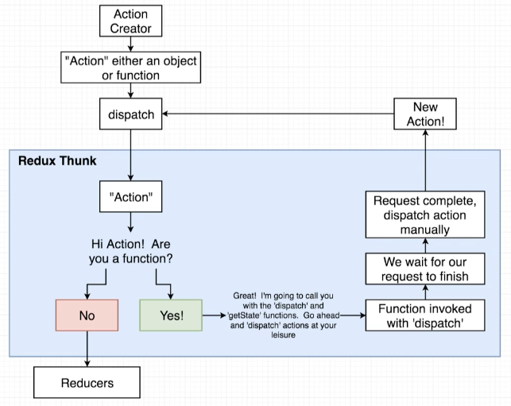

# Redux-Thunk

[npm link](https://www.npmjs.com/package/redux-thunk)

[GitHub link](https://github.com/reduxjs/redux-thunk)

```
npm install redux-thunk
```

Is Middleware to help us make **network** requests in a redux application.

---

Inside of a normal redux application...
- Action creators **must** return an action object.
- That action object **must** have a `type` property and optionally a `payload` property.

# Rules with Redux-Thunk
- Action creator **can** return an action `object` **OR** return a `function` and invokes it automatically. 
- That action object **must** have a `type` property and optionally a `payload` property (same as the normal rules).



1. Action creator - returns either an action object or a function.
2. This gets passed to the dispatch function.
3. Ends up in Redux Thunk.
    - if an object -> passes it to the reducers.
    - if a function
      - invokes the function, passing the `dispatch` and `getState` functions as arguments.
         - `dispatch` is the function that allows you to change any data in the Redux store.
         - `getState` is a function that allows you to read any data in the Redux store.
    - waits for the api request to finish.
    - **manually dispatch an action**.
4. new action gets sent back to the dispatch function.
5. gets sent to redux thunk again.
6. is now an object, and gets sent to the reducers.

# Setting Up Redux-Thunk

inside of `root` `index.js` file:
- import thunk from 'redux-thunk'
- import applyMiddleware from 'redux'

```js
import React from 'react';
import ReactDOM from 'react-dom';
import { Provider } from 'react-redux';
import { createStore, applyMiddleware } from 'redux';
import thunk from 'redux-thunk';

import App from './components/App';
import reducers from './reducers';

// create store
const store = createStore(reducers, applyMiddleware(thunk));

ReactDOM.render(
  <Provider store={store}>
    <App />
  </Provider>,
  document.querySelector('#root')
);;
```

In the **actions** folder: `index.js`...
- we do not need to return an action object if we are using the `thunk` middleware.
- we can now use async await like normal.
- instead, we pass in the dispatch() function.

```js
import jsonPlaceholder from '../apis/jsonPlaceholder';

export const fetchPosts = () => {
  return async function (dispatch, getState) {
    const response = await jsonPlaceholder.get('/posts');

    dispatch({ type: 'FETCH_POSTS', payload: response });
  };
};
```


Refactored (more common to see):
```js
import jsonPlaceholder from '../apis/jsonPlaceholder';

export const fetchPosts = () => async (dispatch) => {
  const response = await jsonPlaceholder.get('/posts');

  dispatch({ type: 'FETCH_POSTS', payload: response });
};
```