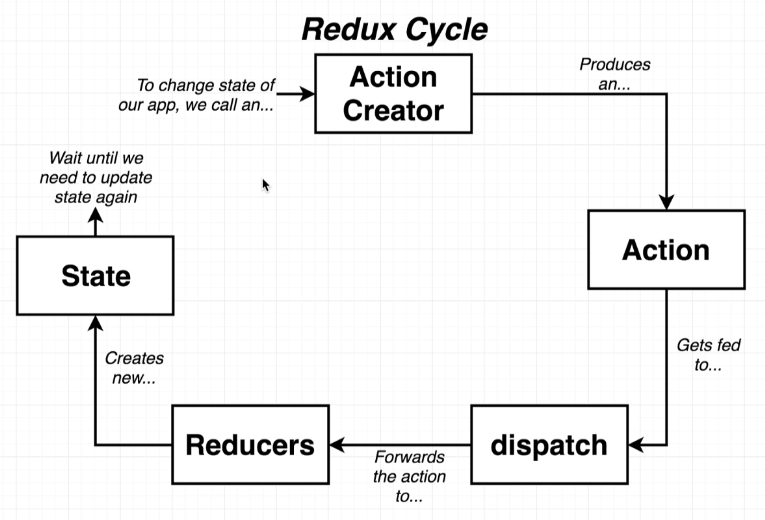

# Redux

What is Redux?
- A state management library for JavaScript apps.
- Makes creating **complex** applications easier. 
- **Not** required to create a React app.
- **Not explicitly** designed to be used with React.

### Redux Cycle:
Action Creator → Action → Dispatch → Reducer → State

1. **Action Creator:**
  - Is a function that creates/returns a plain JavaScript object.
    - The object is known as an **action**.
  - Only purpose is to **create an action**.
2. **Action:**
  - Is a plain JavaScript object.
  - Purpose is to describe some change to the data inside our application.
  - An action has two properties:
    - **type:** A string that defines the **type of action**.
    - **payload:** The **data** that is being **sent** to the **reducer**.
3. **Dispatch Function:**
  - Takes in an action.
  - Makes **copies** of the action.
  - Pass off these copies to different parts of our application.
4. **Reducers:**
  - Is a function responsible for **taking in an action** and processing the data, making some changes to the data, then decides what to do with the data.
  - **Receive** an action.
  - **Change** the state.
  - **Return** a new state.
5. **State property:**
  - Is the central repository of all data that has been created by our Reducer.
  - **All information gets stored** in this property.

## **Action Creator**: People dropping off a form:
```js
// need to create an action for each type of action
// every Action creator has a type property and a payload property
const createPolicy = (name, amount) => {
  return {
    // Action ,a form in our analogy
    type: 'CREATE_POLICY',
    payload: {
      name: name,
      amount: amount,
    },
  };
};

const deletePolicy = (name) => {
  return {
    type: 'DELETE_POLICY',
    payload: {
      name: name,
    },
  };
};

const createClaim = (name, amountOfMoneyToCollect) => {
  return {
    type: 'CREATE_CLAIM',
    payload: {
      name: name,
      amountOfMoneyToCollect: amountOfMoneyToCollect,
    },
  };
};
```
## **Dispatch**: is part of the redux library itself, so we don't need to write it

## **Reducers**: are like our departments
> Need to add `oldListOfClaims = []` in the case we are running this function for the first time.
> If we don't do this, the reducer will be undefined
```js
const claimsHistory = (oldListOfClaims = [], action) => {
  if (action.type === 'CREATE_CLAIM') {
    // we care about this action (FORM)
    // will update our list of claims with the payload
    return [...oldListOfClaims, action.payload]; // takes an array (oldListOfClaims), creates a new array, and adds the payload to the end of the new array
  }
  // we don't care about this action (FORM)
  return oldListOfClaims;
};

const accounting = (bagOfMoney = 100, action) => {
  // case of creating a claim
  if (action.type === 'CREATE_CLAIM') {
    return bagOfMoney - action.payload.amountOfMoneyToCollect;
  }
  // case of creating a policy, signing up.
  else if (action.type === 'CREATE_POLICY') {
    return bagOfMoney + action.payload.amount;
  }
  return bagOfMoney;
};

const policyList = (listOfPolicies = [], action) => {
  if (action.type === 'CREATE_POLICY') {
    return [...listOfPolicies, action.payload.name];
  } else if (action.type === 'DELETE_POLICY') {
    return listOfPolicies.filter((name) => name !== action.payload.name);
  }
  return listOfPolicies;
};
```

**Testing our reducers**:
```js
const { createStore, combineReducers } = Redux;

const ourDepartments = combineReducers({
  // are the names of our various reducers
  accounting: accounting,
  claimsHistory: claimsHistory,
  policyList: policyList,
});

const store = createStore(ourDepartments);

// store object represents our entire redux application. Contains references to all our reducers and their states.
// one function here is the dispatch function.

store.dispatch(createPolicy('Alex', 20))
store.dispatch(createPolicy('Jim', 30))
store.dispatch(createPolicy('Bob', 40))

store.dispatch(createClaim('Alex', 120))
store.dispatch(createClaim('Jim', 50))

store.dispatch(deletePolicy('Bob'))

console.log(store.getState());
```


#### Side note on Spread (...) operator:
```js
const numbers = [1, 2, 3];
const addFour = [...numbers, 4]; // (4) [1, 2, 3, 4] new array created and pushed 4 to the end.
console.log(addFour); // [ 1, 2, 3, 4 ]

console.log(numbers); // [1, 2, 3] still have access to old array
```

# How Redux Works



- Anytime we want to **change state**, we need to **dispatch an [action](https://github.com/Cwarcup/notes/blob/main/root/react/react-notes/redux.md#action-creator-people-dropping-off-a-form)**.
  - uses **action creator**
- Creates an **action**, which gets fed into the **[dispatch function](https://github.com/Cwarcup/notes/blob/main/root/react/react-notes/redux.md#dispatch-is-part-of-the-redux-library-itself-so-we-dont-need-to-write-it)**.
- Dispatcher makes 'copies' of the action, and sends them off to our different **[reducers](https://github.com/Cwarcup/notes/blob/main/root/react/react-notes/redux.md#reducers-are-like-our-departments)**
- **[Reducers](https://github.com/Cwarcup/notes/blob/main/root/react/react-notes/redux.md#reducers-are-like-our-departments)** take in an action and make changes to the state if they need to.